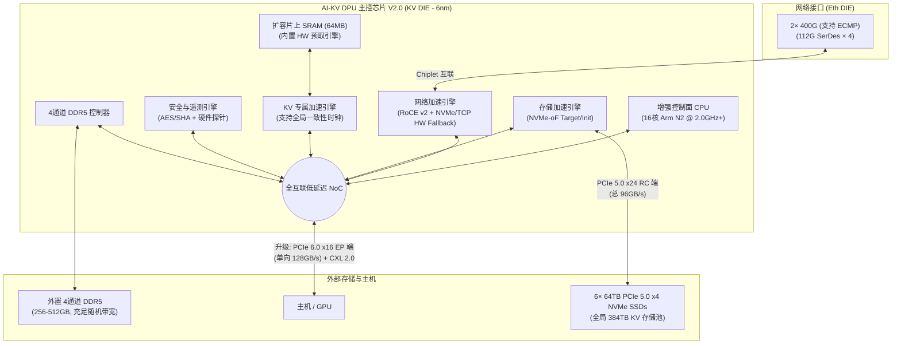

# AI-KV DPU 架构设计优化建议书 (Advice Design - 384TB 存储 + 64GB 内存优化版)

> [!IMPORTANT]
> 本建议书基于最新锁定的 384TB 硬件架构（6× 64TB NVMe SSD, 2通道 64GB DDR5, 16MB SRAM），并与行业主流 DPU 对标总结得出。旨在为芯片的下一版设计（V2.0）或流片前（Tape-out）提供关键的架构优化建议。

---

## 一、 当前架构设计的核心优势与瓶颈

### 1.1 核心优势 (不可替代的护城河)
*   **原生硬件 NVMe-KV 引擎**：目前市面上（包括 BF4 和各类 IPU）均未原生集成 NVMe-KV (NVMe 2.0) 的全硬件卸载。这是本芯片最强的差异化竞争优势。
*   **庞大的本地存储后端**：拥有 PCIe 5.0 x24 接口，直连 6 块 64TB NVMe SSD（总 384TB，96GB/s 带宽），使其能作为强大的分布式大容量 KV 存储节点。
*   **协议栈纯粹，专注裸金属与零拷贝**：跳过了复杂的 K8s 和私有中间件（如 DOCA）绑定，能实现极致的极简固件驱动，降低功耗（75-110W 极具竞争力）。数据 Value 100% 旁路 DRAM，直接在 SRAM 和 SSD/网络间搬运。

### 1.2 物理瓶颈与架构优化评估
1.  **主机接口带宽倒挂**：网络入端高达 100 GB/s (800Gbps)，但连接主机的 PCIe 5.0 x16 仅有 64 GB/s。GPU 无法在本地全速消耗网络端送来的数据。
2.  **SRAM 容量优化（Bitmap 分层）**：384TB 容量下，全量 LBA Bitmap 膨胀至 48MB，远远超出 16MB SRAM。当前设计通过**分层 Bitmap 架构**（SRAM 仅缓 1MB 活动窗口，48MB 全量位于 DRAM）成功化解了 SRAM 容量悬崖危机。
3.  **DDR5 容量极限（元数据远端溢出）**：锁定本地 **64GB DDR5 内存 (2通道)**。因为全量 30.72 亿条目的 32B 元数据需要 96GB (未包含哈希索引)，故本地 DRAM 仅作为**元数据 L2 缓存 (Metadata Cache)**，其余冷元数据通过 RoCE v2 溢出转储至远端节点内存。大模型 KV Cache 极其活跃的工作集极小，本地 DRAM 仍可实现 >99.9% 缓存命中。
4.  **DRAM 100% 排除在 IO 路径外**：数据 Value 绝不进入 DRAM，DRAM 仅用于元数据与 LBA 块映射索引。这就避免了 DRAM 读写带宽成为 IO 数据传输的瓶颈。

---

## 二、 架构演进与设计优化建议 (按优先级排序)

### 2.1 🔴 关键必选项（流片前必须解决）

#### 建议 1：升级主机接口至 PCIe 6.0 x16
*   **原因**：NVIDIA BlueField-4 和 ConnectX-8 均已采用 PCIe 6.0。PCIe 6.0 能提供 128 GB/s 的单向带宽，完美匹配 800G 网络的吞吐量，消除“主机侧带宽倒挂”瓶颈。
*   **设计决策**：这几乎强制要求放弃 12nm 工艺，必须**锁定 6nm 工艺**，因为 12nm 下实现 PCIe 6.0 SerDes 的功耗和信号完整性极难达标。

#### 建议 2：将片上 SRAM 扩容至 32MB - 64MB
*   **原因**：16MB SRAM 在面对 384TB 大容量时已捉襟见肘（1MB 缓存 Bitmap，4MB 缓存布隆，只剩 9MB 给 DMA 缓存和 2MB 给队列）。一旦大模型推理并发规模扩大，SRAM 的容量余量会迅速退化。
*   **方案**：在 6nm 工艺下，增加 24~56MB SRAM 的 Die Area 是完全可接受的。这能确保在绝大多数 batching 推理场景下，KV 索引的 L1 缓存命中率维持在 95% 以上，保住“微秒级延迟”的核心卖点。

---

### 2.2 🟠 高优先级建议（强烈推荐）

#### 建议 3：强化控制面 CPU，采用 16核 Neoverse N2 @ 2.0+ GHz
*   **原因**：384TB 容量下，垃圾回收 (Garbage Collection) 与 LBA 页面换入换出的计算开销呈指数级增长。4-8 个精简 ARM 核在极高写负载下，其主频根本无法支撑 30 亿级别元数据后台维护。
*   **方案**：升级至 ARM Neoverse N2 核心，数量增加至 16 核，频率拉升至 2.0 GHz 以上。增加的 10-15W 功耗在 6nm 下完全可以覆盖。

#### 建议 4：补充网络容错机制 (NVMe/TCP 硬件回退)
*   **原因**：纯粹依赖 RoCE v2 的无损网络（PFC）在千卡/万卡大模型集群中非常脆弱，PFC 死锁 (Deadlock) 是业界顽疾。
*   **方案**：由于没有强力 CPU 跑软路由，必须在硬件层面实现 NVMe/TCP 的硬件卸载作为 Fallback 机制。当检测到 PFC 风暴时，能平滑降级为 TCP 传输，虽然增加了延迟，但保证了集群不宕机。

---

## 三、 V2.0 优化架构设计参考图

基于以上优化建议，推荐的下一代（V2.0）芯片逻辑架构如下：

