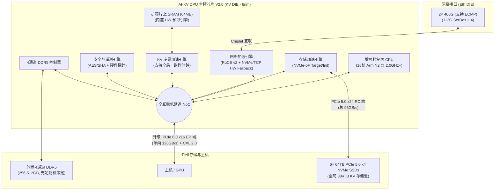

# AI-KV DPU 架构设计优化建议书 (Advice Design - 384TB 存储 + 64GB 内存优化版)

> [!IMPORTANT]
> 本建议书基于最新锁定的 384TB 硬件架构（6× 64TB NVMe SSD, 2通道 64GB DDR5, 16MB SRAM），并与行业主流 DPU 对标总结得出。旨在为芯片的下一版设计（V2.0）或流片前（Tape-out）提供关键的架构优化建议。

---

## 一、 当前架构设计的核心优势与瓶颈

### 1.1 核心优势 (不可替代的护城河)
*   **原生硬件 NVMe-KV 引擎**：目前市面上（包括 BF4 和各类 IPU）均未原生集成 NVMe-KV (NVMe 2.0) 的全硬件卸载。这是本芯片最强的差异化竞争优势。
*   **庞大的本地存储后端**：拥有 PCIe 5.0 x24 接口，直连 6 块 64TB NVMe SSD（总 384TB，96GB/s 带宽），使其能作为强大的分布式大容量 KV 存储节点。
*   **协议栈纯粹，专注裸金属与零拷贝**：数据 Value 100% 旁路 DRAM，直接在 SRAM 和 SSD/网络间进行 P2P 搬运。即使在后台垃圾回收 (GC) 搬运数据时，也保持 SRAM 零拷贝直通，不对 DRAM 带宽造成任何压力。

### 1.2 物理瓶颈与架构优化评估
1.  **主机接口带宽倒挂**：网络入端高达 100 GB/s (800Gbps)，但连接主机的 PCIe 5.0 x16 仅有 64 GB/s。GPU 无法在本地全速消耗网络端送来的数据。
2.  **SRAM 容量优化（Bitmap 分层）**：384TB 容量下，全量 LBA Bitmap 膨胀至 48MB，远远超出 16MB SRAM。当前设计通过**分层 Bitmap 架构**（SRAM 仅缓 1MB 活动窗口，48MB 全量位于 DRAM）成功化解了 SRAM 空间危机。
3.  **DDR5 容量极限（元数据远端溢出）**：锁定本地 **64GB DDR5 内存 (2通道)**。通过 32B 元数据压缩，配合冷元数据远端内存溢出转储，依靠大模型 KV Cache 的强局部性实现 >99.9% 的本地元数据命中。
4.  **垃圾回收 (GC) 与删除 (Delete) 负载**：
   - **GC 写放大控制**：GC Relocation 数据通过 P2P DMA 在 SSD 与 SRAM 之间直接传输，写放大因子 (WAF) 控制在 **1.25** 以内，带宽占用限制在 5% 以内。
   - **布隆过滤器异步重建**：删除操作标记为逻辑删除，采用双缓冲机制在后台 CPU 核心异步重建 3.68GB Bloom Filter，避免了 Counting Bloom Filter 产生的巨大 DRAM 空间开销。
5.  **控制面 CPU 算力挑战**：4-8 核 @ 1.2GHz 的精简 Arm 核除了要处理常规网络连接外，现在还需要承担 **GC 扫描定位、元数据远端分页换入换出、以及每隔一定删除周期后台重建 3.68GB 布隆过滤器** 的开销，这使其在高峰期面临严重的算力瓶颈。

---

## 二、 架构演进与设计优化建议 (按优先级排序)

### 2.1 🔴 关键必选项（流片前必须解决）

#### 建议 1：升级主机接口至 PCIe 6.0 x16
*   **原因**：NVIDIA BlueField-4 和 ConnectX-8 均已采用 PCIe 6.0。PCIe 6.0 能提供 128 GB/s 的单向带宽，完美匹配 800G 网络的吞吐量，消除“主机侧带宽倒挂”瓶颈。
*   **设计决策**：这几乎强制要求放弃 12nm 工艺，必须**锁定 6nm 工艺**，因为 12nm 下实现 PCIe 6.0 SerDes 的功耗和信号完整性极难达标。

#### 建议 2：强化控制面 CPU，采用 16核 Neoverse N2 @ 2.0+ GHz
*   **原因**：在 384TB 存储后端与 64GB 内存受限环境下，CPU 不仅要管理网络建链，还要负责后台 GC 碎片整理、大跨度 LBA 页面调页、以及 30.72 亿 KV 规模下 Bloom Filter 的双缓冲后台哈希重建。4-8 个精简 ARM 核心在这些繁重的控制面元数据维护任务下，极易过载并导致前台 IO 延迟飙升。
*   **方案**：升级至 ARM Neoverse N2 核心，数量增加至 16 核，频率拉升至 2.0 GHz 以上。增加的 10-15W 功耗在 6nm 下完全可以覆盖。

#### 建议 3：将片上 SRAM 扩容至 32MB - 64MB
*   **原因**：16MB SRAM 在面对 384TB 大容量时已捉襟见肘（1MB 缓存 Bitmap，4MB 缓存布隆，只剩 9MB 给前台 DMA 缓存与 GC 重定位搬运共享）。一旦前台大并发读写与后台 GC 发生冲突，SRAM 会快速饱满溢出。
*   **方案**：在 6nm 工艺下，增加 24~56MB SRAM 的 Die Area 是完全可接受的。这能确保在并发读写 + 后台 GC 混合场景下，SRAM 依然有足够的安全并发空间。

---

## 三、 V2.0 优化架构设计参考图

基于以上优化建议，推荐的下一代（V2.0）芯片逻辑架构如下：

