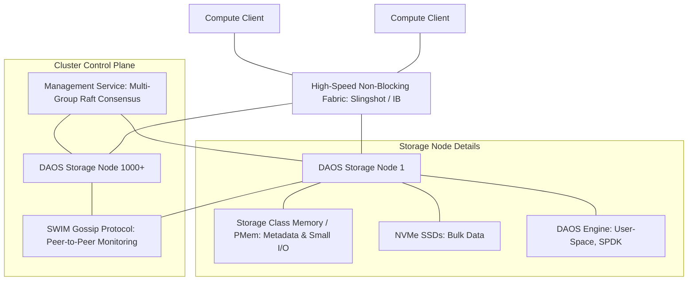

# DAOS Scalability Architecture Design: Supporting 1000+ Nodes

This document provides a detailed architectural design and scaling strategy for deploying a Distributed Asynchronous Object Storage (DAOS) cluster exceeding 1,000 nodes. It incorporates key architectural patterns, lessons learned from Ceph and Lustre, and details specific bottlenecks and mitigations.

---

## 1. Executive Summary & Objective

The objective is to design a high-performance, resilient, and horizontally scalable storage fabric using **DAOS** that adapts to cluster scale:
*   **Small-Scale Cluster (< 128 nodes):** Follows the **Ceph way** (Symmetric Converged Mode) where all nodes are equal, hosting both metadata services and bulk data targets.
*   **Large-Scale Cluster (128 to 1,000+ nodes):** Follows the **Lustre way** (Decoupled Specialized Mode) where node roles are strictly separated into dedicated Metadata Controllers (MDS-like) and Data Storage Engines (OSS-like).

Traditional parallel file systems and scale-out object stores encounter severe bottlenecks at large scale due to centralized metadata servers, lock contention, or network/CPU overheads. This design details the adaptive, role-based scaling framework, identifying bottlenecks, mitigations, and best practices.

---

## 2. Comparative Analysis: Ceph, Lustre, and DAOS

To design a scalable system, we must examine the architectural strengths and weaknesses of established distributed storage systems:

### Ceph (Scale-Out Object/Block/File)
*   **Mechanism:** Ceph relies on the **CRUSH** (Controlled Replication Under Scalable Hashing) algorithm, which dynamically computes data placement locations on-the-fly without a central metadata lookup table.

#### Ceph Hierarchical Failure Domains (Disk, Host, Rack, and Beyond)
To survive physical hardware outages, Ceph structures its physical topology into a nested tree of **CRUSH Buckets**. This hierarchy maps directly to physical boundaries:
1.  **Leaf Nodes (Disks/OSDs):** The basic unit of storage. Each OSD is mapped to a physical disk partition (HDD, SSD, or NVMe).
2.  **Host (Node):** A logical container representing a physical server chassis. Host buckets group multiple OSDs together. Ceph assumes that a host failure takes down all OSDs inside it.
3.  **Chassis & Rack:** Racks group hosts together. A rack boundary represents a shared Top-of-Rack (ToR) switch and a shared Power Distribution Unit (PDU).
4.  **Row & Room:** Racks are grouped into rows, and rows are organized into physical server rooms or datacenters, representing shared cooling or utility feeds.

#### CRUSH Placement Rules & Execution
Ceph routes data by hashing object names into Placement Groups (PGs), which are then mapped to OSDs via the CRUSH map using placement rules.
*   **Step-by-Step Traversal:** A rule executes a top-down search of the bucket tree. For example, a rule with `step chooseleaf firstn 3 type rack` will start at the default `root`, select 3 distinct `rack` buckets using a pseudo-random consistent hash, and then descend each rack branch to choose exactly one `osd` from its hosts.
*   **Failure Domain Enforcement:** By specifying the failure domain `type` (e.g., `rack` or `host`), Ceph guarantees that replica or erasure-coded (EC) shards are physically separated. If `host` is the failure domain, replicas are guaranteed to reside on separate servers. If `rack` is selected, they are guaranteed to reside in separate racks.
*   **Weight Propagation:** Each bucket has a weight calculated as the sum of its children's weights. OSD weights are set proportional to disk capacity (e.g., 1.0 per TB). If an OSD fails, its weight goes to 0. CRUSH propagates this change upward, and the algorithm dynamically relocates only the data shards that resided on the failed disk, avoiding monolithic data copies.

#### Scale Challenges (1,000+ Nodes)
While CRUSH is highly flexible, it faces major bottlenecks at scale:
*   **OSD Map Bloat:** At 1,000+ nodes and 15,000+ OSDs, the OSD map grows to tens of megabytes. Distributing map updates (on every drive state transition) to thousands of hosts saturates network interfaces and consumes significant memory.
*   **Map Storms:** When multiple nodes fail simultaneously, the flurry of map updates causes clients to halt operations while they fetch and process the new CRUSH layout.
*   **Autoscaler Churn:** The PG autoscaler can trigger massive rebalancing events that degrade live client performance.

*   **Key Lesson:** **Symmetry, strict network isolation, and map bounding are vital.** We must isolate public and backend storage networks. More importantly, we should partition the cluster into smaller sub-cluster failure domains to limit the size of layout maps and prevent cluster-wide map updates from bottlenecking operations.

### Lustre (Parallel File System)
*   **Mechanism:** Lustre separates metadata operations (MDS/MDT) from data operations (OSS/OST). It uses direct POSIX-like client mounts and distributes file stripes across OSTs. To scale namespace operations in massive clusters, Lustre implements **Distributed Namespace Expansion (DNE)**, which partitions the global directory tree across multiple MDTs.
*   **Scale Challenges (1000+ Nodes):**
    *   **Metadata Bottlenecks:** Under metadata-heavy workloads (e.g., millions of small files, massive concurrent `open`/`stat` calls), a single MDS/MDT can become a severe bottleneck. Even with DNE subtree partitioning, cross-MDT directory moves or queries can introduce high synchronization latency.
    *   **Distributed Lock Manager (LDLM) Contention:** Heavy locking contention occurs during parallel file writes, where multiple clients try to access the same file boundaries.
    *   **Failure Recovery Complexity:** Running diagnostic tools like LFSCK (Lustre File System Checker) on petabyte-scale environments with billions of files becomes slow, complex, and high-risk.
*   **Key Lesson:** **Eliminate global locks and utilize subtree/directory-level namespace partitioning.** A monolithic cluster should be logically partitioned into smaller self-contained namespace groups to isolate failures and control-plane traffic.

### DAOS (Distributed Asynchronous Object Storage)
*   **Mechanism:** DAOS uses user-space OS bypass (libfabric, SPDK) and treats storage as a transactional object store using Storage Class Memory (SCM) for metadata/small I/O and NVMe for bulk data.
*   **Scale Advantage:** It eliminates central metadata servers (namespace operations are partitioned across the cluster) and does away with a Distributed Lock Manager by utilizing Multi-Version Concurrency Control (MVCC) based on **Epochs**.

---

## 3. Adaptive Clustering & Namespace Partitioning (Ceph vs. Lustre Modes)

DAOS is designed to dynamically scale from small development clusters to exascale high-performance computing (HPC) fabrics. To optimize metadata consensus speeds, limit connection mappings, and isolate network failures, this design implements two scale-dependent clustering paradigms inspired by Ceph and Lustre.

### 3.1. Small-Scale Mode (Symmetric Monolithic / "Ceph" Way)
When the cluster size is small (typically **under 128 nodes**), it is managed as a single monolithic entity.
*   **Cluster Organization:** All storage nodes are grouped into a single monolithic DAOS pool. A single pool map spans the entire hardware fabric.
*   **Namespace Mapping:** The entire filesystem namespace (directory tree) is hosted within a single global container inside this monolithic pool. Data objects are hashed and distributed dynamically across all nodes in the cluster.
*   **Consensus Service:** A single system-wide Raft consensus group (3 or 5 nodes acting as the pool service replicas) manages the configuration and state.
*   **Advantages:**
    - **Resource Pooling:** Maximizes capacity and performance utilization of all SCM and NVMe SSDs across the cluster.
    - **Simplicity:** Lower operational complexity, standard configuration, and easy horizontal growth.

### 3.2. Large-Scale Mode (Partitioned Directory Sub-Clusters / "Lustre" Way)
When the cluster scales to **128 to 1,000+ nodes**, hosting a single monolithic pool becomes a major bottleneck due to massive pool maps, SWIM heartbeat overhead, and rebuild storms. The cluster is instead partitioned into smaller, independent sub-clusters, mirroring Lustre's **Distributed Namespace (DNE)** subtree partitioning.
*   **Cluster Organization:** The 1,000+ node cluster is logically and physically partitioned into $M$ independent sub-clusters (e.g., 8 sub-clusters of 128 nodes each).
    - Each sub-cluster operates as an independent DAOS pool with its own localized pool map, localized SWIM gossip failure detection domain, and localized Raft consensus group.
*   **Directory-Level Namespace Partitioning:** Rather than a single global container, the global namespace is divided at the directory/subtree level. Different directories of the filesystem are mapped to separate containers hosted on different sub-clusters using the **DAOS Unified Namespace (UNS)**.
    - For example, in a scientific HPC cluster:
      - `/fs/home` $\rightarrow$ mapped to Pool 1 (Sub-cluster 1)
      - `/fs/scratch1` $\rightarrow$ mapped to Pool 2 (Sub-cluster 2)
      - `/fs/projects` $\rightarrow$ mapped to Pool 3 (Sub-cluster 3)
*   **Advantages:**
    - **Control Plane Isolation:** Raft log replication and heartbeats are confined within each small sub-cluster, completely eliminating system-wide consensus leader bottlenecks.
    - **Failure Domain / Blast Radius Mitigation:** A node or drive failure only triggers a rebuild storm *within* its specific sub-cluster pool. The other sub-clusters continue running at 100% performance without any network or rebuild traffic interference.
    - **SWIM Scale Reduction:** Confining SWIM gossip protocol probing to sub-clusters of 128 nodes reduces gossip messages from $O(N^2)$ globally to $O((N/M)^2)$ locally, preventing network congestion.
    - **Pool Map Size Reduction:** Clients only need to load and cache the localized pool map for the specific sub-cluster/directory they are accessing, minimizing memory overhead and metadata lookup times.

---

## 4. Project Constraints & Boundaries

When designing and deploying a 1,000+ node DAOS cluster, several hardware, network, and operational constraints must be strictly adhered to:

*   **Hardware Homogeneity:** All 1,000+ storage engines must use identical SCM (Storage Class Memory) or NVMe device classes and sizes. Heterogeneous drive pools degrade layout efficiency and load-balancing performance.
*   **Fabric Non-blocking Guarantee:** The interconnection network must support a non-blocking Fat-Tree topology with RoCEv2 or InfiniBand, guaranteeing uniform latency (less than 2-3 microseconds) and no oversubscription at the core switches.
*   **Kernel Bypass Dependencies:** Compute clients and storage nodes must utilize supported network interface cards (NICs) compatible with libfabric (such as `verbs;rxm` or `cxi`), as standard TCP sockets cannot sustain the required I/O throughput.
*   **Control Plane Scale Limits:** The Management Service (MS) Raft consensus group should be restricted to a maximum of 5 nodes. Increasing MS replica counts beyond 5 introduces consensus log commit latency that degrades management operation speeds.
*   **Minimum Software Baseline:** The cluster must run DAOS v2.6 or newer to leverage multi-group Raft service partitions and advanced Cart RPC server-side forwarding optimizations.

---

## 5. High-Level DAOS Architecture for 1,000+ Nodes

---

## 6. Key Scaling Bottlenecks and Mitigations

As a DAOS cluster scales to 1,000+ nodes, the control and management planes face distinct scalability challenges. The table below summarizes these challenges and their corresponding mitigations:

| Area | Potential Bottleneck | Mitigation Strategy |
| :--- | :--- | :--- |
| **Control Plane** | Management Service (MS) Raft leader bottleneck under high admin/connection loads | Partition metadata using **Multi-Group Raft (Replicated Service - `rsvc`)**; delegate pool/container actions |
| **Failure Detection** | Network/CPU overhead from all-to-all heartbeats across 1,000+ hosts | Optimize **SWIM (Scalable Weakly-consistent Infection-style Group Membership)** gossip parameters |
| **Self-Healing** | "Rebuild Storms" consuming NVMe/SCM bandwidth and saturating network links | Implement **Declustered Rebuilding** with dynamic QoS throttling and high-parity Erasure Coding (e.g., $8+2$ or $16+2$) |
| **Data Path Scaling** | Client connection limits and RPC network congestion | Optimize **Cart RPC** aggregation, implement server-side RPC forwarding, and use non-blocking libfabric providers |
| **RDMA / IB Scaling** | Queue Pair (QP) cache thrashing on NIC HCAs due to $O(N)$ connection states under RC mode | Deploy **UCX transport** with **Dynamically Connected (DC_X)** or **UD_X** modes to bypass hardware cache limits |

---

## 7. Deep-Dive Design Details

### 7.1. Management Service (MS) & Raft Consensus Optimization
The DAOS Management Service (MS) uses the Raft consensus protocol to maintain system membership, pool configurations, and overall system state.
*   **The Problem:** At 1,000+ nodes, a single system-wide Raft group can become overloaded by heartbeats, pool map updates, and client connection bootstrapping.
*   **The Design:**
    1.  **Multi-Group Partitioning:** Rather than using a single global Raft instance for all metadata, DAOS partitions metadata by utilizing separate Raft consensus groups (using the `rsvc` module) for individual pools and container services.
    2.  **MS Replicas Limit:** Limit the core Management Service Raft group size to **3 or 5 nodes** situated on dedicated controller nodes with low-latency network interconnects. This minimizes the consensus overhead (log replication latency) while maintaining high availability.
    3.  **Map Caching:** Implement aggressive client-side caching of the pool maps. Clients only contact the Raft leader when a pool map changes (e.g., during node exclusion or addition).

### 7.2. SWIM Gossip Protocol Tuning
For failure detection, DAOS uses the SWIM (Scalable Weakly-consistent Infection-style Process Group Membership) protocol. SWIM operates by sending periodic, randomized peer-to-peer ping probes instead of quadratic $O(N^2)$ heartbeats.
*   **Tuning Parameters for 1,000+ Nodes:**
    *   **Ping Interval ($T$):** Set the ping interval to **2–3 seconds** to avoid network congestion.
    *   **Sub-group Size ($k$):** When an engine fails to respond to a direct ping, the sender queries $k$ random helper peers (set $k=3$ or $k=4$) to ping the suspect node indirectly.
    *   **Suspect Timeout:** Implement a grace period of **10–15 seconds** before marking a node as `DEAD`. This prevents premature node exclusions caused by transient network spikes or temporary CPU spikes.

### 7.3. Declustered Rebuilding & QoS Throttling
When a node fails, DAOS must rebuild data redundancy (replicas or erasure-coded shards) across the surviving storage targets.
*   **The Design:**
    1.  **Declustered Layout:** By distributing object shards algorithmically using a versioned pool map, the reconstruction load is spread across the remaining 999+ hosts. All surviving nodes participate in reading and writing data, avoiding single-controller bottleneck points.
    2.  **Erasure Coding Tuning:** For a 1,000-node cluster, use large stripe widths like **$8+2$ or $16+2$**. These profiles minimize parity overhead (only 12.5% overhead for $16+2$) while providing dual-fault tolerance.
    3.  **Dynamic QoS Throttling:** Ensure that background rebuild operations do not starve foreground client applications. The DAOS engine should dynamically throttle rebuild bandwidth (e.g., allocating a maximum of 15% of SCM/NVMe throughput and network bandwidth to rebuild RPCs during peak production hours).
    4.  **In-flight Client Reconstruction:** During degraded mode, clients reconstruct missing fragments on the fly in memory. This reduces the immediate read load on the cluster during a rebuild.

### 7.4. Optimized Container Scout Implementation
A **Container Scout** process helps manage storage lifecycle events, clean up orphaned objects, and monitor container space consumption without affecting the fast data path.
*   **The Design:**
    1.  **Distributed Space Scanning:** Decentralize container space auditing by executing local scans on each individual target engine. Each engine reports aggregated statistics back to the container service leader.
    2.  **Epoch-Aware Garbage Collection:** Clean up old snapshots and invalid versions using non-blocking, asynchronous epoch garbage collection. This process should run during low-load intervals, avoiding interference with active client writes.

### 7.5. RDMA/IB Queue Pair (QP) Scaling & Connection Management
At 1,000+ storage nodes and thousands of concurrent clients, managing network connection states becomes a physical hardware bottleneck.
*   **The Problem (QP Thrashing):** 
    In standard InfiniBand networks, utilizing **Reliable Connection (RC)** transport requires a separate Queue Pair (QP) connection from every client compute node to every target engine. As the cluster scales, the active QP count per HCA can quickly exceed 100,000. Because host channel adapters (HCAs) have a finite on-chip cache for QP state, a high QP count causes frequent cache misses, forcing the NIC to retrieve connection states from host memory over PCIe. This results in "QP thrashing", which spikes network latency from single-digit microseconds to hundreds of microseconds and severely degrades storage throughput.
*   **The Design (UCX & DCT Integration):**
    1.  **Transition to UCX Transport:** While libfabric's `verbs;rxm` provider provides generic reliable datagrams, it can suffer from performance overhead under extreme scale. Deploy DAOS configured to use **UCX (Unified Communication X)** as the communications transport middleware.
    2.  **Dynamically Connected Transport (DCT):** Leverage NVIDIA/Mellanox **DC (Dynamically Connected)** transport (such as `DC_X` in UCX). Unlike RC (which requires dedicated $O(N)$ connections), DCT allows one-to-many communication dynamically, requiring only a constant, small number of QPs on the HCA regardless of the cluster scale. This completely eliminates QP cache misses while retaining hardware-offloaded reliability.
    3.  **UD_X Transport Fallback:** For network environments that do not support hardware-level DCT, use UCX's **UD_X (Unreliable Datagram with software reliability)** transport. This configuration shifts connection state tracking to host memory and CPU, preventing hardware HCA cache starvation.

### 7.6. Raft Consensus and Transaction Boundary Analysis
A critical review of the metadata consensus (Raft) and transactional model (Epochs/MVCC) validates and shapes our directory-partitioned sub-cluster design.

*   **Raft Scope Limitation:**
    In DAOS, Raft consensus replicas manage the control plane metadata (system registry, pool maps, container status, and snapshots). It is not involved in the hot I/O data path. By partitioning the 1,000+ node cluster into localized sub-cluster pools (the "Lustre way"), the Raft replication traffic is isolated within independent groups of 3 or 5 nodes per sub-cluster. This keeps the consensus log commit latency low and prevents a control plane outage in one pool from affecting the rest of the cluster.
*   **Transaction Boundaries (SCM/MVCC/2PC):**
    1.  **Container-Level Transactions:** DAOS distributed transactions (ACID guarantees, epoch allocation, and MVCC snapshotting) operate via a non-blocking Two-Phase Commit (2PC) protocol restricted to the boundaries of a **single container**.
    2.  **Cross-Subcluster Transaction Constraint:** Because sub-clusters represent different physical pools and containers, cross-directory namespace movements (e.g., `mv /fs/scratch1/data /fs/projects/data`) across sub-clusters cannot be executed atomically. They are translated by the POSIX client layer as non-atomic data copies and deletes.
    3.  **Architectural Alignment:** This transaction boundary matches typical HPC and AI training workloads. Jobs are typically isolated to a single dataset path (e.g., scratch space or home space). Cross-directory atomic transactions are rarely required. For operations that do require atomicity, clients are advised to isolate files in the same directory container.

### 7.7. Data Protection Layout: EC Groups, Replication Groups, and Failure Domains
To ensure maximum availability at a 1,000-node scale, data protection mechanisms must align with the physical hardware and software process topology.

*   **Hierarchical Failure Domains (Rack -> Node -> Engine -> Target):**
    Unlike monolithic storage nodes, DAOS separates physical servers from software execution engines. The pool map organizes the hardware layout into a nested hierarchy:
    1.  **Rack:** A physical cabinet. Contains multiple servers and represents a shared power distribution unit (PDU) and Top-of-Rack (ToR) network switch.
    2.  **Node (Host):** A physical server motherboard. In a standard high-performance DAOS setup, each physical host runs **2 separate DAOS engines** (one engine statically pinned per NUMA socket) to avoid cross-socket UPI/QPI latency.
    3.  **Engine:** A user-space storage server process. Each engine owns independent CPU cores, a NUMA-local SCM module, a set of NVMe drives, and separate network card context endpoints (via libfabric/UCX).
    4.  **Target:** The actual virtualized I/O service endpoint within the engine, typically mapped to a single NVMe drive or CPU polling thread.

*   **Fault-Domain Placement Rules:**
    Because multiple engines reside on the same physical host, node-level failures present a correlated risk:
    - **Engine-Level Failures:** If a single DAOS engine process crashes (e.g., due to software panic or NUMA link drops), only the targets mapped to that engine fail. The sister engine on the same physical host remains fully operational.
    - **Node-Level Failures:** If a physical host undergoes a hardware failure (e.g., motherboard crash, PDU outage, kernel panic), both engines on that node go down simultaneously.
    - **Mitigation Strategy:** DAOS must be configured with a hierarchical failure domain level of `Node` (for host-level tolerance) or `Rack` (for rack-level tolerance). Setting `Domain = Node` tells the consistent hashing placement engine to distribute shards of the same EC or replication group to engines residing on **different physical hosts**, preventing host failures from taking down multiple shards.

*   **Erasure Coding (EC) Groups:**
    - **Wide-Stripe Configuration:** For the partitioned pools, use wide-stripe EC schemes such as `OC_EC_8P2` ($8$ data, $2$ parity shards) or `OC_EC_16P2` ($16$ data, $2$ parity shards).
    - **Placement Constraints:** With `OC_EC_16P2`, each EC group requires 18 distinct storage engines. By setting the failure domain to `Node` or `Rack` and vertically slicing the 128-node sub-cluster across 18+ physical racks, DAOS guarantees that no two shards of the same EC group reside on the same host or in the same rack.

*   **Replication Groups:**
    Metadata databases and small directory indices (stored in SCM) use replication rather than EC.
    - **Metadata Protection (`OC_RP_3G1` or `OC_RP_5G1`):** Configure metadata containers with 3-way or 5-way replica groups.
    - **Consensus Placement:** The 3 or 5 nodes hosting the Raft consensus service replicas (`pool_svc`) must be placed on engines residing on different physical hosts and in different racks to ensure the management service retains its quorum if a node or rack fails.

---

## 8. Infrastructure & Deployment Best Practices

### 8.1. Network Topology
*   **Unified High-Speed Fabric:** Deploy a non-blocking network fabric (such as InfiniBand NDR or HPE Slingshot) operating at **200 Gbps or 400 Gbps** per port.
*   **Strict Traffic Isolation:** Set up virtual networks (VLANs/VFXs) or dedicated physical interfaces to isolate **client-to-server traffic** (North-South) from **server-to-server replication/rebuild traffic** (East-West).
*   **Libfabric Provider Selection:** Use high-performance libfabric providers (e.g., `verbs;rxm` or `cxi` for HPE Slingshot) to enable OS bypass and direct memory access (RDMA).

### 8.2. Storage Engine Hardware Profile (Per Node)
*   **Metadata Layer (SCM):** Configure each node with **Storage Class Memory (SCM)** or low-latency NVMe (such as Intel Optane or high-write-endurance U.2/U.3 PCIe Gen5 SSDs) at a capacity ratio of approximately 1% to 5% of total NVMe storage.
*   **Bulk Storage Layer (NVMe):** Equip nodes with high-capacity PCIe Gen5 NVMe SSDs configured under user-space **SPDK (Storage Performance Development Kit)** controllers.
*   **Compute Allocation:** Dedicate separate CPU socket cores specifically to the DAOS storage engines to ensure that polling-based SPDK and libfabric threads run without context switching.

### 8.3. Observability & RAS Integration
*   **Centralized Telemetry:** Integrate DAOS telemetry using the native `daos_metrics` exporter to pipe performance metrics into Prometheus and Grafana.
*   **RAS Telemetry:** Use the Reliability, Availability, and Serviceability (RAS) control plane to forward hardware warnings, network drops, and SWIM status changes directly to your centralized log analyzer (ELK, Graylog, or Grafana Loki).
