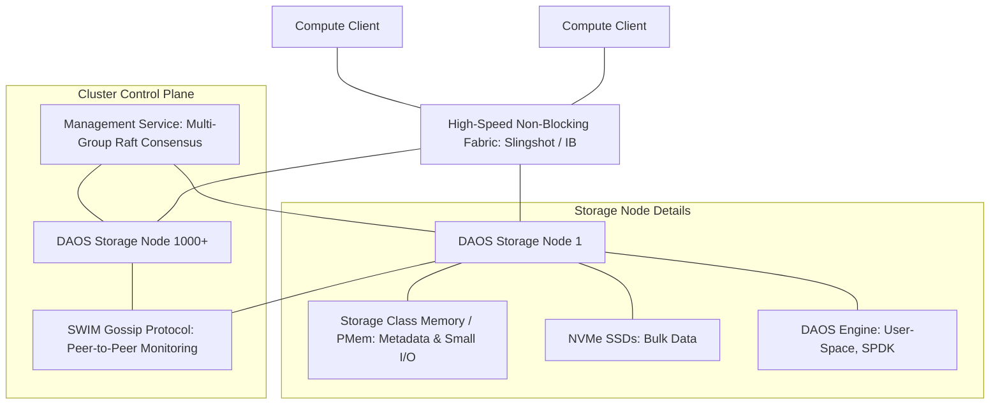

# DAOS 可扩展性架构设计：支持 1000+ 节点

本文件提供了部署超过 1,000 个节点的分布式异步对象存储（DAOS）集群的详细架构设计和扩展策略。其中融入了关键架构模式、从 Ceph 和 Lustre 获得的经验教训，并详细描述了特定瓶颈及其缓解措施。

---

## 1. 执行摘要与目标

本设计的目标是构建一个使用 **DAOS** 的高性能、高弹性且水平可扩展的存储网络，以支持计算集群的存储需求。该设计可根据集群规模进行自适应调整：
*   **小规模集群（< 128 节点）：** 遵循 **Ceph 模式**（对称单体模式），将整个集群作为一个单体的大型存储池运行，数据全局分布。
*   **大规模集群（128 至 1,000+ 节点）：** 遵循 **Lustre 模式**（目录分区子集群模式），将 1,000+ 个节点的集群划分为多个独立的小型子集群（存储池），并在目录/子树级别对全局命名空间进行分区。

在此规模下，传统的并行文件系统（PFS，如 Lustre）和扩展型对象存储（如 Ceph）由于中心化元数据服务器、锁竞争或网络/CPU 开销，常常会遇到严重的性能瓶颈。本设计详细阐述了这种自适应的命名空间分区和集群分组框架，并确定了瓶颈、缓解措施及最佳实践。

---

## 2. 对比分析：Ceph、Lustre 与 DAOS

为了设计一个可扩展的系统，我们必须审视成熟的分布式存储系统的架构优缺点：

### Ceph（可扩展的对象/块/文件存储）
*   **核心机制：** Ceph 依赖 **CRUSH**（Controlled Replication Under Scalable Hashing）算法。该算法动态实时地计算数据的存储位置，无需中心化元数据查找表。

#### Ceph 分层故障域（磁盘、主机、机架及其他）
为抵御物理硬件故障，Ceph 将其物理拓扑结构组织为嵌套的 CRUSH 桶（Buckets）树。该层级结构与物理边界直接映射：
1.  **叶子节点（磁盘/OSD）：** 最基础的存储单元。每个 OSD 映射到一个物理磁盘分区（HDD、SSD 或 NVMe）。
2.  **主机（节点）：** 代表物理服务器机箱的逻辑容器。主机桶将多个 OSD 组合在一起。Ceph 默认认为，主机故障会导致其内部的所有 OSD 同时失效。
3.  **机箱与机架（Chassis & Rack）：** 机架将多台主机组合在一起。机架边界代表共享的机架顶部（ToR）交换机和共享的电源分配单元（PDU）。
4.  **机架排与机房（Row & Room）：** 机架按排整理，排进一步组织为物理机房或数据中心，代表共享的冷却系统或外部供电线路。

#### CRUSH 放置规则与执行机制
Ceph 通过将对象名称哈希到放置组（PG）中，然后使用放置规则，通过 CRUSH 映射将 PGs 映射到 OSD。
*   **逐步遍历：** 放置规则对桶树执行自上而下的搜索。例如，包含 `step chooseleaf firstn 3 type rack` 的规则将从默认 of `root` 开始，使用伪随机一致性哈希选择 3 个不同的 `rack` 桶，然后深入每个机架分支，从其主机中选择刚好一个 `osd`。
*   **故障域强制隔离：** 通过指定故障域类型（例如 `rack` 或 `host`），Ceph 保证了副本或纠删码（EC）分片的物理隔离。如果故障域是 `host`，则可确保副本分布在不同的服务器上。如果选择 `rack`，则可确保副本分布在不同的机架中。
*   **权重传播：** 每个桶的权重计算为其所有子节点权重的总和。OSD 权重与其磁盘容量成正比设置（例如，每 TB 为 1.0）。如果 OSD 失效，其权重归零。CRUSH 将此更改向上级桶传播，算法随之动态重新定位曾位于失效磁盘上的数据分片，从而避免了大规模的无意义数据迁移。

#### 1,000+ 节点规模下的挑战
虽然 CRUSH 极具灵活性，但在超大规模下会面临严重的瓶颈：
*   **OSD Map 膨胀：** 在 1,000+ 节点和 15,000+ OSD 规模下，OSD Map 会增长到数十兆字节。将 map 更新（发生在每次磁盘状态切换时）分发到数千个主机会饱和网络接口并消耗大量内存。
*   **Map 更新风暴：** 当多个节点同时失效时，密集的 map 更新会导致客户端在获取并处理新的 CRUSH 布局时暂停 I/O 操作。
*   **自动扩缩器抖动：** PG 自动扩缩器可能会触发大规模的重平衡事件，降低在线客户端的性能。

*   **关键启示：** **对称性、严格的网络隔离以及 Map 范围限制至关重要。** 我们必须隔离业务和后端存储网络。更重要的是，应当将集群划分为更小的子集群故障域，以限制布局 map 的大小，防止全局 map 更新风暴瓶颈化存储操作。

### Lustre（并行文件系统）
*   **核心机制：** Lustre 将元数据操作（MDS/MDT）与数据操作（OSS/OST）分离开来。它使用直接的类 POSIX 客户端挂载，并将文件分片（Striping）分布在多个 OST 上。为了在大规模集群中扩展元数据性能，Lustre 实现了 **分布式命名空间扩展 (DNE, Distributed Namespace Expansion)**，允许将全局目录树划分到多个 MDT 上运行。
*   **规模挑战（1000+ 节点）：**
    *   **元数据瓶颈：** 在元数据密集型工作负载下（例如，数百万个小文件，海量并发的 `open`/`stat` 调用），单个 MDS/MDT 会成为严重的性能瓶颈。即使采用 DNE 子树分区，跨 MDT 的目录移动或目录查询也会引入高昂的同步延迟。
    *   **分布式锁管理器（LDLM）竞争：** 在并行写入文件期间会产生严重的锁竞争，因为多个客户端会尝试访问相同的文件区间。
    *   **故障恢复复杂度：** 在包含数十亿个文件、数 PB 级规模的环境中，运行 LFSCK（Lustre 文件系统检查器）等诊断工具会变得极其缓慢、复杂且风险高。
*   **关键启示：** **消除全局锁，并利用子树/目录级的命名空间分区。** 单体集群应当被逻辑上划分为更小的、自包含的命名空间组，以实现故障和控制流的隔离。

### DAOS（分布式异步对象存储）
*   **核心机制：** DAOS 使用用户态 OS 旁路（libfabric、SPDK），并将存储视作事务性对象存储，其中使用持久内存/存储级内存（SCM）存储元数据和小 I/O，使用 NVMe 存储大块数据。
*   **规模优势：** 它消除了中心化元数据服务器（命名空间操作被分区到集群的各个节点上），并通过利用基于 **Epochs**（纪元）的多版本并发控制（MVCC）消除了分布式锁管理器。

---

## 3. 自适应集群与命名空间分区（Ceph 与 Lustre 模式）

DAOS 旨在动态地从小型开发集群扩展到极大规模的高性能计算（HPC）网络。为了优化元数据共识速度、限制连接映射并隔离网络故障，本设计实现了两种基于 Ceph 和 Lustre 哲学的自适应集群部署模式。

### 3.1. 小规模模式（对称单体 /“Ceph”方式）
当集群规模较小时（通常在 **128 个节点以下**），集群被作为一个单体的大型实体来管理。
*   **集群组织形式：** 所有存储节点被归入一个单一的单体 DAOS 存储池中。单个存储池图（pool map）覆盖整个硬件网络。
*   **命名空间映射：** 整个文件系统的命名空间（目录树）托管在单体存储池中的一个全局容器（container）中。数据对象通过一致性哈希，动态分布在集群中的所有节点上。
*   **共识服务：** 单个系统范围内的 Raft 共识组（通常选择 3 或 5 个引擎作为池服务的副本）管理配置和状态。
*   **核心优势：**
    - **资源大池化：** 充分利用全集群所有 SCM 和 NVMe SSD 的容量与性能。
    - **管理简单：** 运维复杂度低，配置规范统一，节点水平扩容直观方便。

### 3.2. 大规模模式（目录分区子集群 /“Lustre”方式）
当集群规模达到 **128 至 1,000+ 个节点**时，承载单一的单体存储池会因为池图（pool map）庞大、SWIM 心跳开销激增以及重建风暴而成为重大瓶颈。此时，集群会被划分为更小的、独立的子集群，类似于 Lustre 的 **分布式命名空间 (DNE)** 子树分区设计。
*   **集群组织形式：** 1,000+ 个节点的集群被逻辑和物理地划分为 $M$ 个独立的子集群（例如，8 个包含 128 个节点的子集群）。
    - 每个子集群作为一个独立的 DAOS 存储池运行，拥有自己局部的 pool map、局部的 SWIM 故障检测谣言协议域，以及局部的 Raft 共识组。
*   **目录级命名空间分区：** 摒弃全局的单体容器，将全局命名空间在目录/子树（subtree）级别进行划分。通过 **DAOS 统一命名空间 (UNS, Unified Namespace)**，将文件系统的不同目录挂载并映射到不同子集群的独立容器中。
    - 例如，在科研 HPC 集群中：
      - `/fs/home` $\rightarrow$ 映射到 存储池 1（子集群 1）
      - `/fs/scratch1` $\rightarrow$ 映射到 存储池 2（子集群 2）
      - `/fs/projects` $\rightarrow$ 映射到 存储池 3（子集群 3）
*   **核心优势：**
    - **控制面完全隔离：** Raft 日志复制和心跳流量被局限在各个小型子集群内部，彻底消除了系统级的共识领袖瓶颈。
    - **故障域/冲击半径降至最低：** 节点或磁盘的损坏仅在它所对应的子集群池中触发重建风暴。其他子集群的读写运行在 100% 性能下，不受任何网络或重建流量干扰。
    - **SWIM 规模精简：** 将 SWIM 故障检测协议的探测限制在 128 节点的子集群内，使谣言消息量从全局 $O(N^2)$ 降低到局部的 $O((N/M)^2)$，防止网卡与网络拥塞。
    -### 7.7. 数据保护布局：EC 组、副本组与故障域设计
为确保在 1,000 节点规模下的最高可用性，数据保护机制必须与物理硬件和软件进程拓扑相匹配。

*   **分层故障域配置（机架 -> 节点 -> 引擎 -> 目标）：**
    与单体存储节点不同，DAOS 将物理服务器与软件执行引擎分离开来。存储池图（pool map）将硬件布局组织为嵌套的层级结构：
    1.  **Rack（机架）：** 物理机柜。包含多个服务器，代表共享的电源分配单元（PDU）和机架顶部（ToR）网络交换机。
    2.  **Node（节点/主机）：** 物理服务器主板。在标准的高性能 DAOS 配置中，每台物理主机会运行 **2 个独立的 DAOS 引擎**（每个 NUMA 插槽静态绑定一个引擎），以避免跨插槽的 UPI/QPI 内存总线延迟。
    3.  **Engine（引擎）：** 用户态存储服务器进程。每个引擎拥有独立的 CPU 核心、NUMA 本地 SCM 模块、一组 NVMe 磁盘以及独立的网卡上下文端点（通过 libfabric/UCX）。
    4.  **Target（目标/I/O服务端点）：** 引擎内部虚拟化的实际 I/O 服务端点，通常映射到单个 NVMe 硬盘分区或 CPU 轮询线程。

*   **故障域放置规则与关联失效风险：**
    由于同一个物理主机上驻留有多个引擎，节点级故障会带来关联失效风险：
    - **引擎级故障：** 如果单个 DAOS 引擎进程崩溃（例如由于软件 Panic 或 NUMA 链路断开），只有映射到该引擎的 Target 会失效。同一物理主机上的姐妹引擎依然能完全正常运行。
    - **节点级故障：** 如果物理主机发生硬件故障（例如主板损坏、机箱电源故障、内核崩溃），该节点上的两个引擎将同时下线。
    - **缓解策略：** 必须在 DAOS 中配置分层故障域级别为 `Node`（以容忍主机级故障）或 `Rack`（以容忍机架级故障）。设置 `Domain = Node` 会指示一致性哈希放置引擎将同一个 EC 组或副本组的分片，分布到**驻留在不同物理主机上的引擎中**，从而防止单台主机的损坏导致多个分片同时丢失。

*   **纠删码（EC）组设计：**
    - **宽条带配置：** 对于分区存储池，采用宽条带 EC 方案，例如 `OC_EC_8P2`（8 数据分片，2 校验分片）或 `OC_EC_16P2`（16 数据分片，2 校验分片）。
    - **位置约束：** 在 `OC_EC_16P2` 配置下，每个 EC 组需要 18 个独立的存储引擎。通过将故障域级别设置为 `Node` 或 `Rack`，并将 128 节点的子集群切片分布到 18+ 个物理机架上，DAOS 可以保证同一个 EC 组中没有任何两个分片位于同一个物理主机或同一个机架中。

*   **副本组（Replication Groups）设计：**
    元数据数据库和小型目录索引（存储在 SCM 中）使用副本模式而非 EC。
    - **元数据保护（`OC_RP_3G1` 或 `OC_RP_5G1`）：** 配置元数据容器使用 3 副本或 5 副本组。
    - **共识节点位置分配：** 托管 Raft 共识服务副本（`pool_svc`）的 3 或 5 个节点必须放置在驻留于不同物理主机且位于不同机架的引擎上，以确保在某个主机或机架下线时，Raft 服务依然保留多数派法定人数，持续提供服务而不产生管理面中断。

---�，标准的 TCP 套接字无法支撑所需的 I/O 吞吐量。
*   **控制面规模限制：** 管理服务（MS）Raft 共识组的节点数应严格限制在最多 5 个节点。如果 MS 副本数超过 5 个，共识日志提交的延迟会显著增加，进而降低管理操作的执行速度。
*   **最小软件基线：** 集群必须运行 DAOS v2.6 或更高版本，以利用多组 Raft 服务分区以及先进的 Cart RPC 服务端转发优化。

---

## 5. 1,000+ 节点 DAOS 高级架构

---

## 6. 关键扩展瓶颈及缓解措施

当 DAOS 集群扩展到 1,000+ 节点时，控制面和管理面会面临独特的扩展性挑战。下表总结了这些挑战以及相应的缓解策略：

| 领域 | 潜在瓶颈 | 缓解策略 |
| :--- | :--- | :--- |
| **控制面** | 在高管理负载/连接负载下，管理服务（MS）Raft 领袖成为瓶颈 | 使用 **多组 Raft（副本服务 - `rsvc`）** 对元数据进行分区；下放池（Pool）/容器（Container）操作 |
| **故障检测** | 1,000+ 个主机之间进行全连接心跳（all-to-all heartbeats）带来网络/CPU开销 | 优化 **SWIM（可扩展弱一致感染型小组成员关系）** 谣言协议的参数配置 |
| **自愈恢复** | “重建风暴”消耗 NVMe/SCM 带宽并使网络链路饱和 | 实施具有动态 QoS 限速和高纠删码（EC，如 $8+2$ 或 $16+2$）的 **去中心化重建** |
| **数据路径扩展** | 客户端连接数限制与 RPC 网络拥塞 | 优化 **Cart RPC** 聚合，实施服务端 RPC 转发，并使用非阻塞 libfabric 提供程序 |
| **RDMA / IB 规模扩展** | 由于可靠连接（RC）模式下 $O(N)$ 的连接状态开销，导致网卡 HCA 上的队列对（QP）缓存发生抖动（Thrashing） | 部署配置了动态连接（DC_X）或 UD_X 模式的 **UCX 传输层**，以绕过硬件缓存限制 |

---

## 7. 深度设计细节

### 7.1. 管理服务（MS）与 Raft 共识优化
DAOS 管理服务（MS）使用 Raft 共识协议来维护系统成员关系、池配置和整体系统状态。
*   **问题所在：** 在 1,000+ 节点规模下，单一的全集群 Raft 组容易因心跳消息、池图（pool map）更新和客户端连接引导而载荷过重。
*   **设计方案：**
    1.  **多组分区：** DAOS 不为所有元数据使用单一的全局 Raft 实例，而是通过使用副本服务（`rsvc`）模块，为每个池和容器服务维持独立的 Raft 共识组。
    2.  **限制 MS 副本数：** 将核心管理服务 Raft 组的大小限制为 **3 或 5 个节点**，并将它们部署在具有低延迟网络互连的专用控制器节点上。这在保持高可用性的同时，将共识开销（日志复制延迟）降至最低。
    3.  **Map 缓存机制：** 实施激进的客户端池图（pool map）缓存。客户端仅在池图发生变化时（例如节点被排除或添加时）才会联系 Raft 领袖。

### 7.2. SWIM 谣言协议调优
在故障检测方面，DAOS 使用 SWIM（Scalable Weakly-consistent Infection-style Process Group Membership）协议。SWIM 通过发送周期性的、随机的对等体 ping 探测来工作，而不是采用开销为 $O(N^2)$ 的全连接心跳。
*   **针对 1,000+ 节点的调优参数：**
    *   **Ping 间隔时间（$T$）：** 将 ping 间隔设置为 **2–3 秒**，以避免网络拥塞。
    *   **子组大小（$k$）：** 当某个引擎未响应直接 ping 时，发送端会向 $k$ 个随机的辅助对等体（设置 $k=3$ 或 $k=4$）发送请求，间接 ping 该可疑节点。
    *   **可疑状态超时时间（Suspect Timeout）：** 在将节点标记为 `DEAD` 之前，留出 **10–15 秒** 的宽限期。这可以防止由瞬时网络抖动或临时 CPU 尖峰引起的误判和过早的节点排除。

### 7.3. 去中心化重建与 QoS 限速
当有节点发生故障时，DAOS 必须在存活的存储目标上重建数据冗余（副本或纠删码分片）。
*   **设计方案：**
    1.  **去中心化布局：** 通过利用版本化的池图算法分发对象分片，重建负载被分散到剩余的 999+ 个主机上。所有存活的节点都参与读取和写入数据，避免了单控制器瓶颈。
    2.  **纠删码调优：** 对于 1,000 个节点的集群，使用较大的条带宽度，如 **$8+2$ 或 $16+2$**。这些配置能将校验开销降至最低（例如 $16+2$ 仅有 12.5% 的开销），同时提供双故障容错。
    3.  **动态 QoS 限速：** 确保后台重建操作不会使前台客户端应用产生“饥饿”。DAOS 引擎应当动态限制重建带宽（例如，在业务高峰期，分配给重建 RPC 的 SCM/NVMe 吞吐量和网络带宽最大不超过总带宽的 15%）。
    4.  **客户端在途重建（In-flight Reconstruction）：** 在降级模式下，客户端会在内存中实时重构丢失的数据分片。这减轻了重建期间集群的即时读取负担。

### 7.4. 优化的 Container Scout 空间清理
**Container Scout** 进程负责管理存储生命周期事件、清理孤立对象并监控容器空间消耗，而不干扰快速数据路径。
*   **设计方案：**
    1.  **分布式空间扫描：** 将容器空间审计去中心化，在每个存储引擎上执行本地扫描。每个引擎将聚合后的统计数据上报给容器服务领袖。
    2.  **纪元感知垃圾回收（Epoch-Aware GC）：** 使用非阻塞的、异步的纪元垃圾回收来清理旧快照和失效版本。该过程应在低负载时间段运行，避免干扰活跃的客户端写入操作。

### 7.5. RDMA/IB 队列对（QP）扩展与连接管理
在 1,000+ 个存储节点与数万并发客户端的超大规模下，网络连接状态的管理将成为物理硬件瓶颈。
*   **问题分析（QP 缓存抖动）：**
    在标准的 InfiniBand 网络中，若采用 **可靠连接（RC，Reliable Connection）** 传输模式，每个客户端计算节点都需要与每个存储引擎的 Target 建立独立的队列对（QP）连接。随着集群规模的扩大，每块网卡（HCA）上的活跃 QP 数量可轻易突破 100,000 个。由于网卡芯片的 HCA 缓存（on-chip cache）大小有限，大量的 QP 会导致频繁的缓存缺失（Cache Miss），网卡不得不通过 PCIe 从主机内存中调取连接状态。这会产生严重的“QP 缓存抖动”，使网络延迟从个位数微秒飙升至数百微秒，导致存储吞吐量断崖式下跌。
*   **架构设计（UCX 与 DCT 集成）：**
    1.  **转向 UCX 传输层：** 虽然 libfabric 的 `verbs;rxm` 提供程序可提供通用的可靠数据包服务，但在极端规模下可能会产生额外的性能开销。推荐在 DAOS 中部署 **UCX（Unified Communication X）** 作为底层的通信中间件。
    2.  **动态连接传输（DCT，Dynamically Connected Transport）：** 利用 NVIDIA/Mellanox 网卡特有的 **DC（Dynamically Connected）** 传输技术（例如 UCX 中的 `DC_X`）。与 RC 模式不同，DCT 支持动态的一对多通信，无论集群规模扩展到多大，网卡上只需要维持固定数量的少许 QP，从而彻底消除 QP 缓存缺失，同时保留硬件卸载的高可靠性。
    3.  **UD_X 传输层备选方案：** 对于不支持硬件级 DCT 的网络环境，可配置 UCX 的 **UD_X（带软件可靠性保证的不可靠数据报）** 传输模式。该配置将连接状态维护转移到主机内存和 CPU 处理，防止网卡 HCA 的硬件缓存吞噬。

### 7.6. Raft 共识与事务边界分析
对元数据共识（Raft）和事务模型（Epochs/MVCC）的深入审查验证并塑造了我们目录分区的子集群设计。

*   **Raft 共识范围限制：**
    在 DAOS 中，Raft 共识副本管理控制面元数据（系统注册表、存储池图、容器状态和快照），并不参与热 I/O 数据路径。通过将 1,000+ 节点的集群划分为局部的子集群池（即 “Lustre” 方式），Raft 复制流量被隔离在每个子集群独立且固定的 3 或 5 个节点组内。这保持了极低的共识日志提交延迟，并防止了单个存储池的控制面故障波及整个集群。
*   **事务边界分析（SCM/MVCC/2PC）：**
    1.  **容器级事务限制：** DAOS 分布式事务（ACID 保证、纪元分配和 MVCC 快照）通过非阻塞的两阶段提交（2PC）协议运行，该协议严格限制在单个容器（container）的边界之内。
    2.  **跨子集群事务约束：** 由于不同的子集群代表不同的物理存储池和容器，因此跨子集群的跨目录命名空间操作（例如 `mv /fs/scratch1/data /fs/projects/data`）无法原子地执行。它们被 POSIX 客户端层解释为非原子的“数据复制后删除”操作。
    3.  **架构契合度：** 这种事务边界契合典型 HPC 和 AI 训练工作负载。计算作业通常隔离在单数据集路径内（如专属 scratch 空间或 home 空间），极少需要跨目录的原子事务。对于确需原子操作的业务，建议客户端将相关文件隔离在相同的目录容器内。

### 7.7. 数据保护布局：EC 组、副本组与故障域设计
为确保在 1,000 节点规模下的最高可用性，数据保护机制必须与物理硬件拓扑相匹配。

*   **分层故障域配置：**
    存储池图（pool map）必须配置分层的故障域结构：`Rack（机架） -> Node（节点） -> Engine（引擎）`。
    - **机架级容错：** 在大规模集群中，故障通常是机架局部的（例如机架顶部 ToR 交换机故障、电源分配单元 PDU 故障）。
    - **跨机架切片规划：** 为了支持机架级容错，128 个节点的子集群绝不能孤立在单个物理机架内。相反，它们应当在机架之间进行“垂直切片”（例如，在 16 个不同的机架中，每个机架分配 8 个节点）。
*   **纠删码（EC）组设计：**
    DAOS 使用一致性哈希将 EC 对象分片映射到故障域层次结构的独立分支上。
    - **宽条带配置：** 对于分区存储池，采用宽条带 EC 方案，例如 `OC_EC_8P2`（8 数据分片，2 校验分片）或 `OC_EC_16P2`（16 数据分片，2 校验分片）。
    - **位置约束：** 在 `OC_EC_16P2` 配置下，每个 EC 组需要 18 个独立的存储引擎。通过将 128 节点的子集群切片分布到 18+ 个物理机架上，DAOS 可以保证同一个 EC 组中没有任何两个分片位于同一个机架中。即便某个机架完全断电，也只会丢失 1 个分片，从而实现无缝的在线数据恢复，不会出现降级停服。
*   **副本组（Replication Groups）设计：**
    元数据数据库和小型目录索引（存储在 SCM 中）使用副本模式而非 EC。
    - **元数据保护（`OC_RP_3G1` 或 `OC_RP_5G1`）：** 配置元数据容器使用 3 副本或 5 副本组。
    - **共识节点位置分配：** 托管 Raft 共识服务副本（`pool_svc`）的 3 或 5 个节点必须放置在不同的机架中。如果某个机架下线，Raft 服务依然保留多数派法定人数（例如 4/5 或 2/3 的活动副本），持续提供服务而不产生管理面中断。

---

## 8. 基础设施与部署最佳实践

### 8.1. 网络拓扑
*   **统一高速网络：** 部署端口速率为 **200 Gbps 或 400 Gbps** 的无阻塞网络（如 InfiniBand NDR 或 HPE Slingshot）。
*   **严格流量隔离：** 划分虚拟网络（VLAN/VFX）或使用专用物理网口，将**客户端到服务端流量**（南北向）与**服务端到服务端复制/重建流量**（东西向）严格隔离开来。
*   **Libfabric 提供程序选择：** 使用高性能的 libfabric 提供程序（例如，用于 Mellanox 网卡的 `verbs;rxm` 或用于 HPE Slingshot 的 `cxi`），实现操作系统旁路和远程直接内存访问（RDMA）。

### 8.2. 存储引擎硬件配置（单节点）
*   **元数据层（SCM）：** 每个节点配置 **存储级内存（SCM）** 或超低延迟 NVMe（如 Intel Optane 或高写入寿命的 U.2/U.3 PCIe Gen5 SSD），容量约为总 NVMe 存储容量 of 1% 至 5%。
*   **大块存储层（NVMe）：** 配置大容量 PCIe Gen5 NVMe SSD，并通过用户态 **SPDK（存储性能开发套件）** 控制器进行管理。
*   **计算核分配：** 将专用的 CPU 核心静态分配给 DAOS 存储引擎，确保基于轮询模式的 SPDK 和 libfabric 线程运行期间不发生线程上下文切换。

### 8.3. 可观测性与 RAS Integration
*   **集中式指标监控：** 利用 DAOS 原生的 `daos_metrics` 导出程序收集性能指标，并接入 Prometheus 和 Grafana。
*   **RAS 告警：** 利用可靠性、可用性和可服务性（RAS）控制面，将硬件告警、网络掉线和 SWIM 节点状态变化直接转发到集中式日志分析平台（ELK、Graylog 或 Grafana Loki）。
