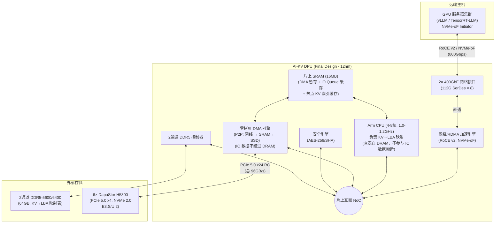
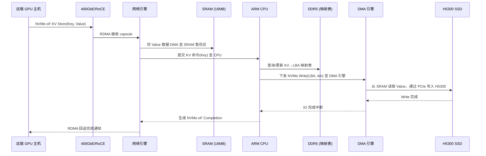
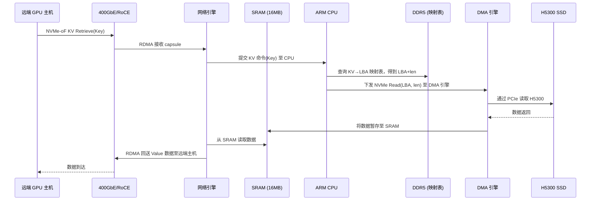
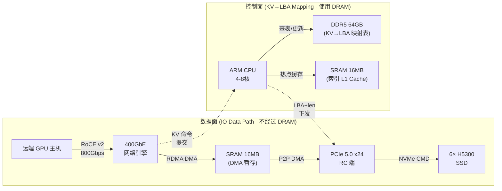

# AI-KV DPU 最终硬件设计分析 (Final Design)
> [!IMPORTANT]
> 本文档为 AI-KV DPU 的**最终确定硬件设计**。明确锁定以下规格，不再迭代硬件参数：
> - 2× 400GbE 网络（合计 800Gbps）
> - 24× PCIe 5.0 通道（6× NVMe SSD）
> - 16MB 片上 SRAM
> - 2 通道 64GB DDR5 内存
> - NVMe-oF KV 服务（ARM 固件实现 KV→LBA 映射）
> - IO 数据不经过 DRAM（零拷贝直通路径）
> - 指定 SSD：DapuStor H5300 PCIe 5.0 NVMe SSD
---
## 一、架构逻辑图

---
## 二、数据路径深度分析（核心设计决策）
### 2.1 IO 数据路径（零拷贝，不经过 DRAM）
这是本设计最关键的架构决策。IO 数据流完全绕过 DDR5 DRAM，通过 SRAM 作为暂存完成网络到 SSD 的零拷贝传输。
#### 写入路径 (KV Store)

#### 读取路径 (KV Retrieve)

> **关键点**：在整个 IO 数据路径中，Value 数据仅经过 **SRAM** 作为 DMA 暂存，**从不进入 DDR5 DRAM**。DRAM 仅被 ARM CPU 用于查询和更新 KV→LBA 映射表（控制面元数据）。
### 2.2 控制面路径（KV→LBA 映射，运行在 ARM + DRAM）
|
 组件 
|
 角色 
|
 数据类型 
|
|
:---
|
:---
|
:---
|
|
**
ARM CPU
**
|
 运行 KV→LBA 映射固件 
|
 不接触 IO 数据 
|
|
**
DDR5 64GB
**
|
 存储完整的 KV→LBA 映射表 
|
 Key 索引 + LBA 地址 + 元数据 
|
|
**
SRAM 16MB
**
|
 热点 KV 索引缓存 (L1 Cache) 
|
 高频访问的 Key→LBA 条目 
|
---
## 三、DapuStor H5300 SSD 规格与系统级分析
### 3.1 单盘规格
|
 参数 
|
 H5300 规格 
|
|
:---
|
:---
|
|
**
接口
**
|
 PCIe Gen5 x4, NVMe 2.0 
|
|
**
顺序读
**
|
 14,000 MB/s (14 GB/s) 
|
|
**
顺序写
**
|
 9,000-9,500 MB/s (~9 GB/s) 
|
|
**
4K 随机读
**
|
 2,800,000 IOPS 
|
|
**
4K 随机写
**
|
 750,000-800,000 IOPS 
|
|
**
读延迟 (4K)
**
|
 < 54 μs 
|
|
**
写延迟 (4K)
**
|
 < 8 μs 
|
|
**
容量
**
|
 3.2 TB - 25.6 TB 
|
|
**
Form Factor
**
|
 E3.S / E1.S / U.2 
|
|
**
耐久度
**
|
 3 DWPD 
|
|
**
控制器
**
|
 Marvell Bravera PCIe 5.0 
|
|
**
闪存
**
|
 3D eTLC NAND 
|
|
**
特性
**
|
 FDP, Multi Stream, TCG OPAL 2.0, PLP 
|
### 3.2 六盘聚合性能（6× H5300 通过 PCIe 5.0 x24）
|
 指标 
|
 单盘 
|
 6 盘聚合 
|
 PCIe x24 上限 
|
 利用率 
|
|
:---
|
:---
|
:---
|
:---
|
:---
|
|
**
顺序读
**
|
 14 GB/s 
|
**
84 GB/s
**
|
 96 GB/s 
|
 87.5% ✅ 
|
|
**
顺序写
**
|
 9 GB/s 
|
**
54 GB/s
**
|
 96 GB/s 
|
 56.3% ✅ 
|
|
**
4K 随机读 IOPS
**
|
 2.8M 
|
**
16.8M
**
|
 - 
|
 - 
|
|
**
4K 随机写 IOPS
**
|
 0.8M 
|
**
4.8M
**
|
 - 
|
 - 
|
|
**
总容量 (7.68TB盘)
**
|
 7.68 TB 
|
**
46.08 TB
**
|
 - 
|
 - 
|
|
**
总容量 (15.36TB盘)
**
|
 15.36 TB 
|
**
92.16 TB
**
|
 - 
|
 - 
|
### 3.3 带宽管道对齐分析
```
网络入口:  100 GB/s (800Gbps)
    │
    ├─→ SSD 顺序读聚合:   84 GB/s  → 利用率 84%  ✅ 轻微过配，可接受
    ├─→ SSD 顺序写聚合:   54 GB/s  → 利用率 54%  ⚠️ 写入场景网络闲置近半
    │
PCIe x24 管道:  96 GB/s
    │
    └─→ 匹配网络 100 GB/s  → 比值 0.96:1  ✅ 优秀对齐
```
> [!NOTE]
> 顺序读场景下带宽对齐良好（84/100 = 84%）。顺序写场景存在网络过配（54/100 = 54%），但这是 NAND 物理写入速度的固有限制，非架构问题。在 KV Cache 典型工作负载中（读多写少，约 8:2 到 9:1），整体利用率将达到 **75-80%**，属于优秀水平。
---
## 四、SRAM 16MB 容量分析
### 4.1 SRAM 用途分配
|
 用途 
|
 分配 
|
 说明 
|
|
:---
|
:---
|
:---
|
|
**
DMA 暂存缓冲区
**
|
 8 MB 
|
 网络↔SSD 零拷贝传输中的数据暂存区。按 128KB 典型 KV Value 大小计，可同时 inflight 64 个 IO 
|
|
**
NVMe-oF 队列缓存
**
|
 2 MB 
|
 SQ/CQ 描述符缓存。每条目 64B，2MB 可缓存 ~32K 条目，远超实际需求 
|
|
**
热点 KV 索引缓存
**
|
 6 MB 
|
 KV→LBA 映射表的 L1 缓存。按每条目 48B（16B Key hash + 8B LBA + 8B length + 16B metadata），可缓存 ~131K 热点条目 
|
### 4.2 KV→LBA 映射表容量估算
|
 场景 
|
 KV 条目数 
|
 每条目大小 
|
 映射表总大小 
|
 存储位置 
|
|
:---
|
:---
|
:---
|
:---
|
:---
|
|
 热点索引 (SRAM) 
|
 ~131K 
|
 48 B 
|
**
6 MB
**
|
 片上 SRAM 
|
|
 全量索引 (DRAM) 
|
 ~10M-100M 
|
 48 B 
|
**
480 MB - 4.8 GB
**
|
 DDR5 64GB 
|
|
 DDR5 剩余可用 
|
 - 
|
 - 
|
**
~59-63 GB
**
|
 可用于固件、日志等 
|
> 64GB DDR5 可轻松容纳 1 亿条 KV 映射（~4.8GB），即使按 256B 平均 Value 大小，也可索引 **25.6 TB** 的有效 KV 数据——正好覆盖 6 盘 H5300 的全部容量。
---
## 五、ARM CPU KV→LBA 映射性能分析
### 5.1 映射查表延迟
|
 命中位置 
|
 查表延迟 
|
 场景 
|
|
:---
|
:---
|
:---
|
|
**
SRAM 命中
**
 (热点缓存) 
|
 ~5-10 ns 
|
 高频访问的热 Key 
|
|
**
DDR5 命中
**
 (全量表) 
|
 ~80-120 ns 
|
 冷 Key 或首次访问 
|
|
**
合计单次 KV→LBA 转换
**
|
 ~10-150 ns 
|
 远低于 SSD 本身延迟 (54μs) 
|
### 5.2 CPU 吞吐量估算
|
 参数 
|
 数值 
|
 说明 
|
|
:---
|
:---
|
:---
|
|
 ARM 核心数 
|
 4-8 核 
|
 @ 1.0-1.2 GHz 
|
|
 单核 KV 查表吞吐 
|
 ~2-5M ops/s 
|
 包含 hash 计算 + DRAM/SRAM 查表 
|
|
 8 核总吞吐 
|
 ~16-40M ops/s 
|
 并行处理 
|
|
 6× H5300 聚合 4K IOPS 
|
 16.8M (读) / 4.8M (写) 
|
 SSD 侧上限 
|
|
**
CPU 是否瓶颈？
**
|
**
否
**
 ✅ 
|
 CPU 吞吐（16-40M）> SSD IOPS（16.8M） 
|
> [!TIP]
> ARM CPU 的 KV→LBA 映射吞吐量（16-40M ops/s）**高于** 6 盘 H5300 的最大聚合 IOPS（16.8M 随机读），因此 **CPU 不是瓶颈**。真正的延迟贡献者是 SSD 本身的物理读延迟（54μs），ARM 的查表延迟（10-150ns）在其中占比不到 0.3%。
### 5.3 典型端到端延迟分解
|
 阶段 
|
 延迟 
|
 说明 
|
|
:---
|
:---
|
:---
|
|
 网络传输 (RoCE v2) 
|
 ~1-2 μs 
|
 RDMA 单程 
|
|
 NVMe-oF capsule 解析 
|
 ~0.5-1 μs 
|
 硬件加速 
|
|
 ARM KV→LBA 查表 
|
**
~0.01-0.15 μs
**
|
 SRAM 或 DRAM 查表 
|
|
 DMA 调度 + PCIe 传输 
|
 ~1-2 μs 
|
 SRAM→SSD 
|
|
**
SSD 物理 IO (H5300)
**
|
**
~
54 μs (读) / 
~
8 μs (写)
**
|
 绝对主导延迟 
|
|
 DMA 回传 + RDMA 发送 
|
 ~1-2 μs 
|
 SSD→SRAM→网络 
|
|
**
总端到端 (4K 随机读)
**
|
**
~58-62 μs
**
|
 SSD 延迟占 87%+ 
|
|
**
总端到端 (4K 随机写)
**
|
**
~12-15 μs
**
|
 SSD 延迟占 53%+ 
|
---
## 六、DDR5 2 通道带宽分析
### 6.1 DDR5 仅承载控制面流量
|
 DDR5 流量类型 
|
 估算带宽需求 
|
 说明 
|
|
:---
|
:---
|
:---
|
|
 KV→LBA 映射查表 (SRAM miss) 
|
 ~2-5 GB/s 
|
 假设 50% SRAM 未命中率，每次 miss 读 64B 
|
|
 映射表更新（写入） 
|
 ~0.5-1 GB/s 
|
 KV Store 时更新映射条目 
|
|
 固件代码 + 管理任务 
|
 ~0.1 GB/s 
|
 微不足道 
|
|
**
总 DRAM 带宽需求
**
|
**
~3-6 GB/s
**
|
|
|
**
2通道 DDR5-6400 可用带宽
**
|
**
~40-50 GB/s (顺序)
**
 / 
**
~15-20 GB/s (随机)
**
|
|
|
**
利用率
**
|
**
15-40%
**
|
 ✅ 充裕 
|
> 由于 IO 数据完全不经过 DRAM，DDR5 的带宽压力极低。即使在最恶劣的全随机小 IO 场景下，DRAM 带宽仍有 **60%+ 余量**。这验证了 2 通道 DDR5 对本设计完全足够。
---
## 七、SRAM 16MB 零拷贝 DMA 缓冲区深度分析
### 7.1 并发 IO 能力
|
 参数 
|
 数值 
|
|
:---
|
:---
|
|
 DMA 缓冲区分配 
|
 8 MB 
|
|
 典型 KV Value 大小 (LLM KV Cache) 
|
 64-256 KB 
|
|
 按 128KB 计算可并发 inflight IO 
|
**
64 个
**
|
|
 按 256KB 计算可并发 inflight IO 
|
**
32 个
**
|
|
 单个 IO 在 SRAM 中驻留时间 
|
~
55-65 μs (读) / 
~
10-15 μs (写) 
|
### 7.2 SRAM 是否会成为瓶颈？
以 4K 随机读为例（最高 IOPS 场景）：
- 16.8M IOPS × 4KB = **67 GB/s** 数据流过 SRAM
- SRAM 读写带宽（12nm 典型值）：**200-400 GB/s**
- SRAM 带宽利用率：17-34% → **✅ 不是瓶颈**
以 128KB 顺序读为例（最高带宽场景）：
- 84 GB/s 数据流过 SRAM
- SRAM 带宽利用率：21-42% → **✅ 不是瓶颈**
> [!TIP]
> SRAM 在两种极端场景下（最高 IOPS 和最高带宽）都有充足余量。16MB 的容量选择在 DMA 暂存和 KV 热点索引之间取得了良好平衡。
---
## 八、最终架构总览

### 最终规格确认表
|
 参数 
|
 最终规格 
|
 状态 
|
|
:---
|
:---
|
:---:
|
|
 网络 
|
 2× 400GbE (800Gbps, RoCE v2) 
|
 ✅ 锁定 
|
|
 PCIe (SSD 侧) 
|
 24× PCIe 5.0 (6× x4 RC) 
|
 ✅ 锁定 
|
|
 PCIe (主机侧) 
|
 无（独立 SH 模式） 
|
 ✅ 锁定 
|
|
 SRAM 
|
 16 MB 
|
 ✅ 锁定 
|
|
 DDR5 
|
 2 通道, 64GB, DDR5-5600/6400 
|
 ✅ 锁定 
|
|
 CPU 
|
 ARM 精简核, 4-8核, 1.0-1.2GHz 
|
 ✅ 锁定 
|
|
 KV 实现方式 
|
 ARM 固件 KV→LBA 映射 
|
 ✅ 锁定 
|
|
 IO 数据路径 
|
 零拷贝 (网络→SRAM→SSD, 不经 DRAM) 
|
 ✅ 锁定 
|
|
 SSD 
|
 DapuStor H5300, PCIe 5.0 x4, NVMe 2.0 
|
 ✅ 锁定 
|
|
 工艺 
|
 12nm 
|
 ✅ 锁定 
|
|
 功耗 
|
 75-110W (估算) 
|
 ✅ 锁定 
|
### 性能指标汇总
|
 指标 
|
 数值 
|
 瓶颈来源 
|
|
:---
|
:---
|
:---
|
|
**
最大顺序读吞吐
**
|
 ~84 GB/s 
|
 6× H5300 SSD 上限 
|
|
**
最大顺序写吞吐
**
|
 ~54 GB/s 
|
 NAND 写入速度 
|
|
**
最大 4K 随机读 IOPS
**
|
 ~16.8M 
|
 6× H5300 SSD 上限 
|
|
**
最大 4K 随机写 IOPS
**
|
 ~4.8M 
|
 6× H5300 SSD 上限 
|
|
**
4K 随机读端到端延迟
**
|
 ~58-62 μs 
|
 SSD 物理延迟主导 (54μs) 
|
|
**
4K 随机写端到端延迟
**
|
 ~12-15 μs 
|
 SSD 物理延迟主导 (8μs) 
|
|
**
KV→LBA 映射延迟贡献
**
|
 < 0.15 μs 
|
 占总延迟 < 0.3% 
|
|
**
最大存储容量
**
|
 92 TB (6×15.36TB) 
|
 H5300 最大单盘容量 
|
|
**
并发 Initiator 数
**
|
 数百 
|
 ARM CPU 建链能力 
|
