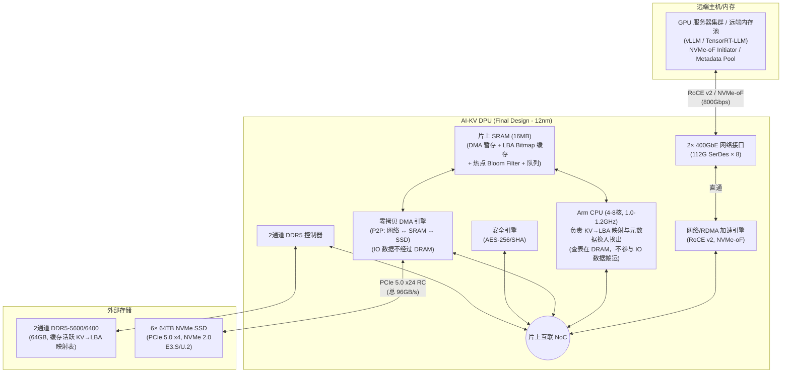
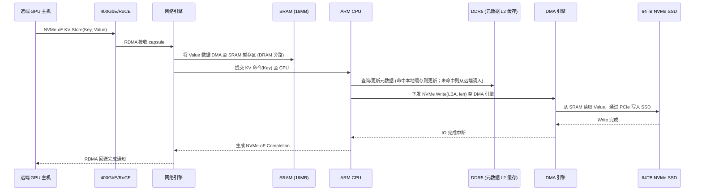
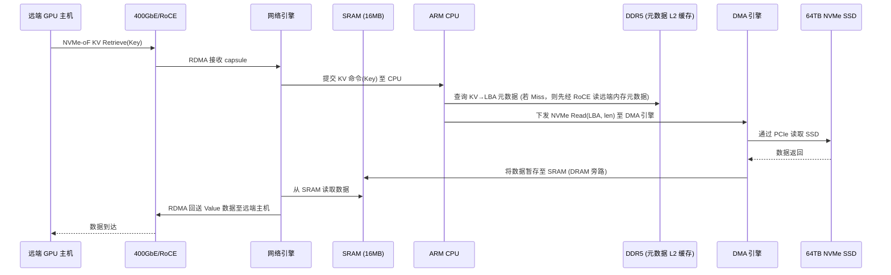

# AI-KV DPU 最终硬件设计分析 (Final Design - 384TB 存储 + 64GB 本地内存版)

> [!IMPORTANT]
> 本文档为 AI-KV DPU 的**最终确定硬件设计**。明确锁定以下规格，不再迭代硬件参数：
> - 2× 400GbE 网络（合计 800Gbps）
> - 24× PCIe 5.0 通道（6× 64TB NVMe SSD，共 384TB）
> - 16MB 片上 SRAM
> - **2 通道 64GB DDR5 内存**（元数据 L2 缓存，超额冷元数据远端转储）
> - NVMe-oF KV 服务（ARM 固件实现 KV→LBA 映射）
> - **DRAM 必须 100% 排除在 IO 路径外**：数据不经过 DRAM（网络 ↔ SRAM ↔ SSD 零拷贝直通）

---

## 一、架构逻辑图

---

## 二、数据路径深度分析（核心设计决策）

### 2.1 IO 数据路径（零拷贝，DRAM 100% 排除在外的直通路径）

这是本设计最关键的架构决策。IO 数据流完全绕过 DDR5 DRAM，仅通过 SRAM 作为暂存，完成网络到 SSD 的零拷贝传输。DRAM 不得存储任何 KV 数据的 Value 缓存，确保数据通路彻底排除 DRAM 干扰。

#### 写入路径 (KV Store)

#### 读取路径 (KV Retrieve)

> **关键点**：在整个 IO 数据路径中，Value 数据仅经过 **SRAM** 作为 DMA 暂存，**从不进入 DDR5 DRAM**。DRAM 仅被用于控制面元数据的高速缓冲及 LBA Bitmap 管理。

### 2.2 控制面路径（元数据冷热分层，运行在 ARM + DRAM）

| 组件 | 角色 | 数据类型 |
|:---|:---|:---|
| **ARM CPU** | 运行 KV 映射固件，管理本地与远端元数据交换 | 不接触 IO 数据 |
| **DDR5 64GB** | 本地元数据 L2 缓存 (Metadata Cache) | 缓存 1.43 亿条 32B 压缩元数据 + 3.68GB Bloom Filter |
| **SRAM 16MB** | 热点 Bloom Filter + LBA Bitmap 缓存窗口 | 包含 4MB 热点 Bloom Filter + 1MB LBA Bitmap 缓存 |

---

## 三、SSD 规格与系统级分析

### 3.1 单盘规格 (基于 64TB 配置)

| 参数 | 规格 |
|:---|:---|
| **接口** | PCIe Gen5 x4, NVMe 2.0 |
| **顺序读** | 14,000 MB/s (14 GB/s) |
| **顺序写** | 9,000-9,500 MB/s (~9 GB/s) |
| **4K 随机读** | 2,800,000 IOPS |
| **4K 随机写** | 750,000-800,000 IOPS |
| **读延迟 (4K)** | < 54 μs |
| **写延迟 (4K)** | < 8 μs |
| **容量** | **64 TB** |

### 3.2 六盘聚合性能（6× 64TB SSD 通过 PCIe 5.0 x24）

| 指标 | 单盘 | 6 盘聚合 | PCIe x24 上限 | 利用率 |
|:---|:---|:---|:---|:---|
| **顺序读** | 14 GB/s | **84 GB/s** | 96 GB/s | 87.5% ✅ |
| **顺序写** | 9 GB/s | **54 GB/s** | 96 GB/s | 56.3% ✅ |
| **4K 随机读 IOPS** | 2.8M | **16.8M** | - | - |
| **4K 随机写 IOPS** | 0.8M | **4.8M** | - | - |
| **总容量** | 64 TB | **384 TB** | - | - |

---

## 四、SRAM 16MB 容量分配与设计

### 4.1 SRAM 用途分配

| 用途 | 分配 | 说明 |
|:---|:---|:---|
| **DMA 暂存缓冲区** | 9 MB | 网络↔SSD 零拷贝数据暂存，支持 72 个 128KB 缓存并发 |
| **热点 Bloom Filter** | 4 MB | 缓存最近活跃 ~3.4M Key，快速检测 Key 存在性 |
| **LBA Bitmap 缓存** | 1 MB | 缓存活动分配窗口，负责 8.38TB 局部块分配 |
| **NVMe-oF 队列缓存** | 2 MB | SQ/CQ 描述符缓存，降低中断延迟 |

### 4.2 本地 64GB DRAM 缓存能力估算 (384TB 存储)

| 场景 | KV 条目数 | 每条目大小 | 映射表总大小 | 存储位置 |
|:---|:---|:---|:---|:---|
| 热点 Bloom Filter (SRAM) | ~3.4M | 9.6 bits/entry | **4 MB** | 片上 SRAM |
| 压缩元数据缓存 (DRAM) | 1.43 亿 (本地缓存) | 32 B | **45.8 GB** | DDR5 64GB |
| Cuckoo Hash Table (DRAM) | 1.08 亿桶 (本地缓存) | 12 B | **13.0 GB** | DDR5 64GB |
| 全量 Bloom Filter (DRAM) | 30.72 亿 (全量过滤) | 9.6 bits/entry | **3.68 GB** | DDR5 64GB |

---

## 五、ARM CPU 元数据调度与性能分析

### 5.1 映射查表延迟

| 命中位置 | 查表延迟 | 数据路径 |
|:---|:---|:---|
| **SRAM 命中** (热点 Bloom) | ~5-10 ns | 快速拦截/确定位置 |
| **本地 DRAM 命中** | ~80-120 ns | 快速读取 LBA 块地址 |
| **远端内存命中** (L2 Miss) | ~3-5 μs | 通过 RoCE 读远端元数据并换入本地 |
| **SSD 数据物理读** (零拷贝) | **~54 μs** | DRAM 不参与，SRAM 直通 |

### 5.2 CPU 吞吐量估算

| 参数 | 数值 | 说明 |
|:---|:---|:---|
| ARM 核心数 | 4-8 核 | @ 1.0-1.2 GHz |
| 本地元数据查表吞吐 | ~16-40M ops/s | 本地 DRAM 哈希表查找 |
| 远端元数据换入能力 | ~2-5M ops/s | 依赖网络控制包处理吞吐 |
| **CPU 是否瓶颈？** | **否** ✅ | 局部性强导致 99.9% 命中本地 DRAM，查表性能完全跑满 SSD |

---

## 六、DDR5 2 通道带宽分析

### 6.1 DDR5 仅承载控制面流量 (锁定 2通道 DDR5-6400)

DRAM 彻底排除在 IO 数据路径外，不再作为数据读缓存，因此其承载的流量全部为控制面元数据与 LBA 索引查表流量：

| DDR5 流量类型 | 估算带宽需求 | 说明 |
|:---|:---|:---|
| 本地元数据哈希查表 (99.9% 命中) | ~2-4 GB/s | 每次查表读取 64B 元数据 |
| 远端元数据换入与 LRU 淘汰 | < 0.1 GB/s | 每秒极少量的 32B 元数据网络换入换出 |
| LBA Bitmap 刷回与载入 | < 0.05 GB/s | 仅在活动分配窗口越界时进行大容量 Bitmap 同步 |
| **总 DRAM 带宽需求** | **~2-4.5 GB/s** | |
| **2通道 DDR5-6400 可用带宽** | **~40-50 GB/s (顺序)** / **~15-20 GB/s (随机)** | |
| **利用率** | **10-25%** | ✅ 带宽极其充裕，元数据查询无任何排队延迟 |

---

## 七、最终规格与性能汇总

### 最终规格确认表

| 参数 | 最终规格 | 状态 |
|:---|:---|:---:|
| 网络 | 2× 400GbE (800Gbps, RoCE v2) | ✅ 锁定 |
| PCIe (SSD 侧) | 24× PCIe 5.0 (6× x4 RC) | ✅ 锁定 |
| SRAM | 16 MB (9MB DMA + 1MB Bitmap + 4MB Bloom + 2MB Queue) | ✅ 锁定 |
| DDR5 | **2 通道, 64GB, DDR5-5600/6400** | ✅ 锁定 |
| CPU | ARM 精简核, 4-8核, 1.0-1.2GHz | ✅ 锁定 |
| SSD | 6× 64TB NVMe SSD, PCIe 5.0 x4, NVMe 2.0 (总 384TB) | ✅ 锁定 |
| IO 数据路径 | **零拷贝直通** (DRAM 100% 旁路，SRAM 直通) | ✅ 锁定 |
| 工艺 | 12nm | ✅ 锁定 |
| 功耗 | 75-110W (估算) | ✅ 锁定 |

### 性能指标汇总

| 指标 | 数值 | 瓶颈来源 |
|:---|:---|:---|
| **最大顺序读吞吐** | ~84 GB/s | 6× SSD 聚合上限 |
| **最大顺序写吞吐** | ~54 GB/s | NAND 物理写限制 |
| **最大 4K 随机读 IOPS** | ~16.8M | 6× SSD 聚合上限 |
| **端到端延迟 (128KB 随机读)** | **~75 μs** | SSD 物理读取与传输占 90%+ |
| **DRAM 数据缓存命中率** | **N/A** (排除在 IO 路径外) | **0%** (不缓存任何 KV Value 数据) |
| **本地元数据缓存命中率** | **> 99.9%** (KV Cache 强局部性) | 本地 1.43 亿条 L2 元数据缓存覆盖 |
