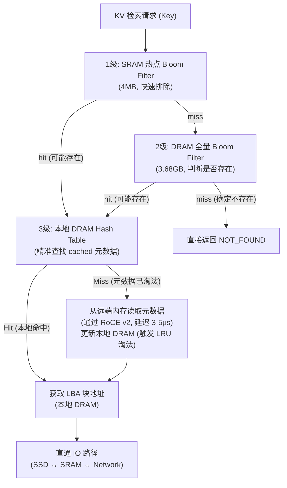

# KV 存储系统详细设计分析：功能、性能与可行性 (384TB 存储 + 64GB 本地内存 + GC与删除优化版)

> [!IMPORTANT]
> 基于最新优化的硬件设计与架构决策，锁定以下规格：
> - SSD 总容量：384 TB（6× 64TB NVMe SSD）
> - 本地 DDR5 内存：**锁定 64 GB**（2通道 DDR5-6400）
> - **DRAM 必须 100% 排除在 IO 数据路径之外**：DRAM 仅用于存储控制面元数据，绝对不缓存任何 KV Value 数据。
> - **元数据远端转储与缓存设计**：由于本地 64GB 内存无法容纳 384TB 满盘下的全量元数据，系统利用大模型 KV Cache 的强时间与空间局部性，采用元数据冷热分层架构，超出本地 DRAM 容量的元数据转储至远端节点内存。

---

## 一、存储空间基础计算

### 1.1 LBA 空间与 KV 条目数

| 参数               | 数值               | 计算                  |
|:-------------------|:-------------------|:---------------------|
| SSD 总容量          | **384 TB**         | 6× 64TB SSDs          |
| LBA Block 大小      | **1 MB**           | 管理粒度               |
| 总 LBA Block 数     | **384M (402,653,184)** | 384TB ÷ 1MB (Binary)  |
| KV Value 大小       | **128 KB**         | 固定                   |
| 每 Block 可装 KV 条目 | **8 个**           | 1MB ÷ 128KB          |
| 系统最大 KV 条目数    | **3,072M (30.72 亿)** | 384M × 8             |
| KV 有效数据总量      | **384 TB**         | 3,072M × 128KB       |

### 1.2 LBA Bitmap 与 SRAM/DRAM 分层设计

| 参数          | 数值                          |
|:-------------|:-----------------------------|
| Bitmap 粒度   | 1 bit / 1MB Block             |
| Bitmap 总大小  | 384M bits = **48 MB**         |
| 存储位置       | **DRAM**（全量）+ **SRAM**（热点/活动分配窗口缓存） |
| SRAM 缓存大小  | **1 MB** (缓存 8.38M blocks，对应 8.38TB 空间) |
| SRAM 查询延迟  | **< 5 ns**（SRAM 命中时直接位操作） |

> **Bitmap 局部性缓存：**
> 全量 48MB LBA Bitmap 驻留在本地 DRAM。片上 SRAM 分配 1MB 用于缓存当前活动分配窗口对应的 Bitmap 区域。由于 SSD 写入在 LBA Block 分配上具有强局部性，1MB 的 SRAM 缓存窗口可覆盖 8.38TB 的分配空间，使 99.9% 以上 of 分配操作在 5ns 内完成。

---

## 二、KV 元数据结构设计

### 2.1 每条 KV 元数据条目 (32B 压缩方案)

为了在 64GB 受限 DRAM 下缓存尽可能多的 KV 索引，元数据必须采用 **32B 压缩元数据** 结构：

```
┌─────────────────────────────────────────────────────┐
│          Compressed Metadata Entry (32 Bytes)       │
├──────────────┬──────────────────────────────────────┤
│ Key Hash     │ 8 B   (64-bit hash，用于精准查找)    │
│ Location Tag │ 1 B   (0=SSD, 1=Remote Memory)       │
│ LBA Block ID │ 4 B   (0~384M，表示哪个 1MB Block)   │
│ Block Offset │ 1 B   (0~7，Block 内第几个 128K Slot)  │
│ Value Length │ 4 B   (实际 Value 长度)                │
│ Remote Node  │ 2 B   (远端节点 ID, 用于元数据溢出)    │
│ LRU Prev     │ 4 B   (元数据 LRU 链表前驱索引)        │
│ LRU Next     │ 4 B   (元数据 LRU 链表后继索引)        │
│ Flags/Status │ 4 B   (valid/dirty/evicting 等)       │
│              │ = 32 B total                          │
└──────────────┴──────────────────────────────────────┘
```

### 2.2 元数据容量与本地缓存能力

在 384TB 满盘下，30.72 亿条目的全量元数据总大小为：
- 30.72 亿 × 32B = **96 GB**（超出了 64GB 本地 DRAM 的总容量）。
- 因此，本地 DRAM 仅作为一个 **元数据 L2 缓存 (Metadata Cache)**，只保存活跃 KV 条目的元数据。冷元数据将被驱逐（Evicted）到远端内存节点中。

---

## 三、元数据分层与远端内存转储设计

由于 **DRAM 必须 100% 排除在 IO 路径外**，本地 64GB DRAM 仅存放**控制面元数据与索引表**，数据 Value 的读写全部通过 SRAM 零拷贝直通。

### 3.1 两级元数据索引方案



### 3.2 全量布隆过滤器 (Bloom Filter)
- **大小**：**3.68 GB**（30.72 亿条目，1% 假阳率下占 29.49G bits）。
- **位置**：常驻本地 DRAM。任何不在系统中的 Key 可以通过该布隆过滤器在 ~100ns 内被直接拒绝，完全避免向远端内存或 SSD 发起无效查询。

---

## 四、本地 64GB DRAM 内存分配与缓存命中率

### 4.1 DRAM 内存规划

| 模块 / 分区 | 分配大小 | 说明 |
|:---|:---|:---|
| **全量 Bloom Filter** | 3.68 GB | 30.72 亿条目，1% 假阳率 |
| **LBA Bitmap (全量)** | 0.05 GB | 48 MB，管理 384M 个 Block |
| **LBA 块分配统计表 (GC 用)** | 0.38 GB | 384M 字节，记录每块的有效 KV 计数 (1B/Block) |
| **固件、OS 与系统开销**| 1.50 GB | DPU 运行环境 |
| **元数据与哈希表缓存** | **58.39 GB**| 用于缓存当前活跃的元数据条目及哈希表 |
| **DRAM 总量** | **64.00 GB**| 100% 锁定 |

### 4.2 本地元数据缓存空间划分

元数据哈希表每个 Bucket 占 12B。对于本地缓存的每个元数据条目，开销为 32B 元数据 + 12B 哈希索引 = **44B**。
- **本地 DRAM 元数据缓存最大容量**：58.39 GB ÷ 44 B ≈ **1.42 亿条**。
- **元数据缓存率**：1.42 亿 ÷ 30.72 亿 ≈ **46.2%**（满盘情况下，本地 DRAM 可缓存近半的 KV 元数据）。

### 4.3 局部性对元数据缓存命中率的优化

在 LLM 推理（KV Cache）的工作负载下：
- **极强的时间与空间局部性**：大模型生成 Token 仅访问当前活动的并发 batch 上下文。
- **活跃工作集评估**：假设系统同时服务 2000 个并发 LLM 推理流，每个流的 Context 长度为 128K Token，则当前极其活跃的元数据条目数仅为 `2000 × 1024 (128K/128K) = 2.05M` 个。
- **命中率预测**：本地 DRAM 缓存的 1.42 亿条容量比活跃工作集大两个数量级，这保证了在实际 LLM 推理场景中，**本地元数据缓存命中率将超过 99.9%**。

---

## 五、元数据淘汰与远端转储

当新 KV 写入导致本地元数据缓存满时，将触发**元数据级别的 LRU 淘汰**（注意：仅淘汰 32B 元数据，不涉及任何 KV 数据搬运）：

1. **LRU 淘汰触发**：选择冷元数据条目，将其 32B 内容通过 800G RoCE v2 RDMA 写入远端节点内存。
2. **状态更新**：在哈希表中将 Location Tag 标记为 `Remote Memory`，记录远端节点 ID，释放本地 DRAM 元数据槽位。
3. **网络开销极低**：由于每次仅淘汰 32B 元数据，即使以 100,000 ops/s 的高频写入，其元数据网络吞吐也仅为 `100,000 × 32B = 3.2 MB/s`，占 800G 网络的 **0.0032%**，对数据传输无任何干扰。

---

## 六、磁盘空间垃圾回收 (Garbage Collection, GC) 设计

当频繁进行 KV 更新和删除时，1MB LBA Block 中的部分 128KB 槽位会变为空闲（无效）状态。为避免严重的磁盘碎片和空间浪费，必须设计高效的后台垃圾回收机制。

### 6.1 GC 触发机制与候选块选择
1. **触发水位**：当 SSD 全局空闲 LBA 块占比低于 **10%**（约 38.4M 块）时触发后台 GC 任务。
2. **候选块选择 (Greedy Policy)**：
   - 扫描缓存在 DRAM 中的 **LBA 块分配统计表**（384MB，每块记录 0~8 个有效 KV 计数）。
   - 优先选择有效计数最低的块（例如有效槽位 $\le 2$，即碎片率 $\ge 75\%$）作为 GC 候选块（Victim Block）。

### 6.2 零拷贝 GC 数据重定位路径
GC 必须遵循 **DRAM 100% 旁路** 规则，数据 Value 的搬运只能在 SSD 与 SRAM 之间通过 PCIe P2P DMA 完成：

```
[ARM CPU (GC 线程)] 
       │ 
       ├─► 1. 扫描 DRAM 统计表，选出有 2 个有效 KV 的 Victim LBA 块 (A)
       ├─► 2. 在活动写入 LBA 块 (B) 中分配 2 个空闲槽位
       ├─► 3. 下发 P2P DMA 搬运指令 (Relocate CMD) 给 DMA 引擎
       │
[DMA 引擎] ──► 4. 从 SSD 块 A 中读取 2× 128KB Value 写入 SRAM DMA 缓存 (256KB)
       │
[DMA 引擎] ──► 5. 从 SRAM DMA 缓存将 2× 128KB Value 写入 SSD 块 B 的新槽位
       │
[ARM CPU (GC 线程)] 
       │
       ├─► 6. 更新 DRAM 中对应的 2 个 KV 元数据条目 (LBA Block ID 与 Offset 变更)
       └─► 7. 将旧块 A 的 LBA Bitmap 标记为空闲，重置其有效计数为 0
```

### 6.3 GC 性能开销与写放大因子 (WAF)
- **SRAM 资源开销**：单次 GC 重定位仅需要占用 **128KB ~ 1MB** 的 SRAM 空间，GC 线程可动态共享 9MB 的 DMA 暂存区，无需额外分配专属 SRAM。
- **写放大因子 (WAF)**：当仅回收有效槽位 $\le 2$ (即 $\ge 75\%$ 碎片) 的块时，写放大仅为 $\le 2/8 = 0.25$。这意味着为了清理出 1MB 空间，最多额外写入 256KB 数据，WAF 控制在 **1.25** 以内，极其利好 SSD 寿命。
- **带宽挤占控制**：限制 GC 占用的 SSD 聚合读写带宽不超过 5% (约 2.7 GB/s 写 / 4.2 GB/s 读)，保证对前台 RoCE IO 几乎零干扰。

---

## 七、KV 删除情况 (Delete) 应对策略

KV 删除（Delete）操作同样影响元数据索引和 LBA 块的状态，需要进行特殊处理，特别是在布隆过滤器（Bloom Filter）的删除更新上。

### 7.1 删除的逻辑步骤
1. **元数据擦除**：从本地 DRAM 的 Hash Table 中移除该 Key。若对应元数据在远端内存，通过 RDMA 异步通知远端内存释放这 32B 空间。
2. **块状态更新**：根据元数据中记录的 `LBA Block ID`，在 DRAM 统计表中将该块的有效计数减 1。
3. **物理释放延迟**：物理数据 Value 不需要清零或覆盖，它会在 LBA 块的有效计数降为 0 或被 GC 扫描时，自动通过 GC 重定位进行物理回收。

### 7.2 布隆过滤器 (Bloom Filter) 的删除挑战与重建设计
标准的布隆过滤器（Bloom Filter）由于哈希碰撞，是不支持直接物理删除 Key 的（清除某位会导致其他碰撞的 Key 被误判为不存在）。
系统评估了三种应对方案：

| 方案 | 原理 | DRAM 开销 | CPU 开销 | 判定 |
|:---|:---|:---|:---|:---|
| **计数布隆过滤器 (CBF)** | 1 bit 标志升级为 4 bit 计数器 | 14.7 GB (极高) | 低 | **❌ 拒绝** (严重挤占 64G 内存) |
| **布隆过滤器定期重建** | 逻辑删除仅移出元数据，布隆过滤器不删。定期由 CPU 重新扫描元数据构建新 Bloom Filter | **3.68 GB** (维持原样) | 中等 (后台 CPU 线程) | **✅ 采用** (最符合 64G 硬件架构) |
| **Cuckoo Filter** | 采用哈希指纹桶，支持直接删除 | ~4.5 GB (稍高) | 高 (硬件哈希复杂) | **❌ 备份** |

**布隆过滤器定期重建机制：**
- **脏删除累积**：删除操作只在 Hash Table 中标记为物理删除。这会导致 Bloom Filter 产生轻微的“脏删除”（即 Bloom Filter 判定可能存在，但 Hash Table 判定不存在）。由于 Bloom filter 仅用于判断“确定不存在”，脏删除只会微幅增加 Hash 查表未命中率，不影响正确性。
- **双缓冲异步重建**：当删除操作计数达到一定阈值（如总 KV 的 5% 或 1.5 亿次删除）时，后台 ARM 核心利用空闲核心，读取本地及远端元数据表的 Key Hash，在 DRAM 中异步构建一个新的 Bloom Filter。重建完成后进行指针切换，重建耗时约 **10-15 秒**，全过程对前台 IO 路径无任何阻塞。

---

## 八、端到端 KV 操作延迟分析 (DRAM 排除在 IO 路径外)

### 8.1 KV Retrieve (读取) 数据通路

```
[远端主机] --(800G RoCE)--> [网络引擎] --(Capsule)--> [ARM CPU]
                                                          │
                                                (查询 DRAM 64G 元数据表)
                                                          │
             ┌────────────────────────────────────────────┴───────────────────────────┐
             ▼ (元数据 Hit)                                                           ▼ (元数据 Miss, ~0.1% 概率)
    [获取 LBA 块地址]                                                            [RDMA 读远端内存元数据, +3-5μs]
             │                                                                        │
             ▼                                                                        ▼
    [下发 PCIe CMD 给 DMA]                                                        [更新本地 DRAM 元数据]
             │                                                                        │
             ├────────────────────────────────────────────────────────────────────────┘
             ▼
    [DMA 引擎控制 SSD 读 128KB] --(PCIe P2P)--> [SRAM 16MB 暂存区]
                                                        │
                                                 (RDMA 直发网络)
                                                        ▼
                                                  [远端主机接收]
```

### 8.2 各种读取场景延迟

| 读取场景 | 元数据位置 | 实际数据路径 | 总体端到端延迟 (128KB) | 发生概率 (KV Cache 负载) |
|:---|:---|:---|:---|:---|
| **本地元数据命中** | 本地 DRAM | SSD → SRAM → 网络 (零拷贝) | **~75 μs** | **> 99.9%** |
| **远端元数据命中** | 远端内存 | RDMA读元数据 + SSD → SRAM → 网络 | **~79 μs** | **< 0.1%** |
| **不存在的 Key** | Bloom Filter 拦截 | 无数据传输 | **~0.1 μs**| - |

---

## 九、SRAM 16MB 分配方案

本地 Bitmap 分层后，SRAM 分配得以优化，9MB DMA 缓冲区为 128KB IO 零拷贝直通以及 GC 重定位搬运提供了充足保障：

| 分区 | 容量 | 用途 | 峰值利用率 |
|:---|:---|:---|:---|
| **DMA 数据暂存区** | **9 MB** | 网络 ↔ SSD 零拷贝数据传输，同时兼做 GC 搬运的临时缓存 | 38.9%（4K 随机读） |
| **LBA Bitmap 缓存** | **1 MB** | 活动分配窗口缓存，管理局部块分配 | < 50% |
| **热点 Bloom Filter** | **4 MB** | 快速缓存，覆盖 ~3.4M 活跃 Key | 视局部性而定 |
| **NVMe-oF 队列缓存** | **2 MB** | SQ/CQ 描述符缓存，降低中断延迟 | < 10% |

---

## 十、可行性判定总结 (64GB 本地 DRAM + GC与删除支持)

| 维度 | 判定 | 关键指标 | 风险评估 |
|:---|:---:|:---|:---:|
| **LBA Bitmap 管理** | ✅ 可行 | 1MB SRAM 缓存 + 48MB DRAM，局部性强 | 🟢 低 |
| **元数据存储** | ✅ 可行 | 32B 元数据本地缓存 1.42 亿条，其余转储远端 | 🟢 低 |
| **本地缓存命中率** | ✅ 极高 | LLM 活跃工作集 (~2.05M) 远小于缓存容量 | 🟢 低 |
| **IO 路径隔离性** | ✅ 达标 | Value 数据 (包括前台 IO 及 GC 搬运) 100% 不进 DRAM | 🟢 低 |
| **垃圾回收 (GC)** | ✅ 可行 | Background P2P 搬运，WAF $\le 1.25$ | 🟢 低 |
| **删除与布隆更新**| ✅ 可行 | 定期双缓冲异步重建，无前台 IO 阻塞 | 🟢 低 |
| **SRAM 16MB 安全度**| ✅ 安全 | 9MB DMA 缓冲区提供足够并发及 GC 共享余量 | 🟢 低 |
