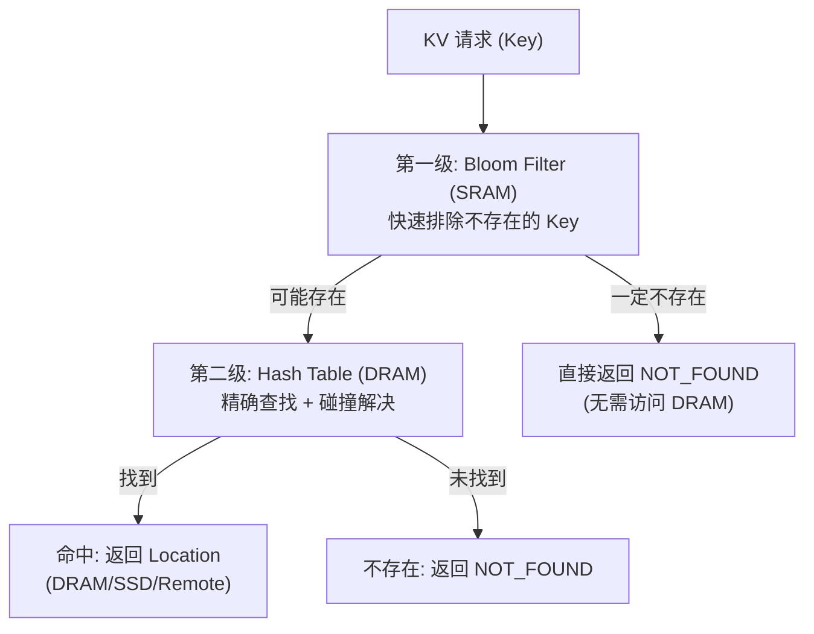
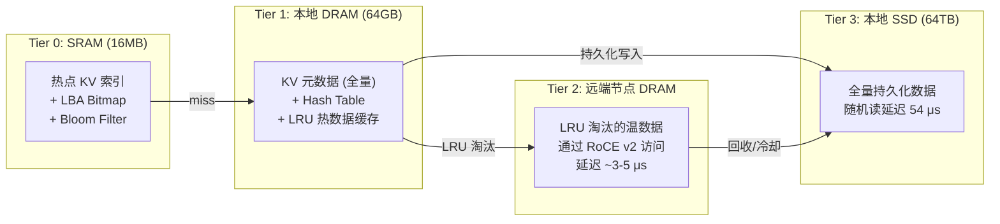

# KV 存储系统详细设计分析：功能、性能与可行性
> [!NOTE]
> 基于最终硬件设计（2×400GbE, PCIe 5.0 x24, 16MB SRAM, 2通道 64GB DDR5），分析以下设计约束下的完整 KV 存储系统：
> - SSD 总容量：64TB（6× DapuStor H5300）
> - LBA 管理粒度：1MB Block，bitmap 分配
> - KV 条目 Value 大小：128KB
> - Hash 判断 KV 是否存在
> - DRAM 做 KV 数据 LRU 缓存
> - 超 DRAM 容量部分通过 800G 网络转储至远端节点内存
---
## 一、存储空间基础计算
### 1.1 LBA 空间与 KV 条目数
| 参数               | 数值               | 计算                  |
|:-------------------|:-------------------|:---------------------|
| SSD 总容量          |**64 TB**| 6× H5300 (~10.67TB/盘) |
| LBA Block 大小      |**1 MB**| 管理粒度               |
| 总 LBA Block 数     |**64M (67,108,864)**| 64TB ÷ 1MB          |
| KV Value 大小       |**128 KB**| 固定                   |
| 每 Block 可装 KV 条目 |**8 个**| 1MB ÷ 128KB          |
| 系统最大 KV 条目数    |**512M (5.12 亿)**| 64M × 8              |
| KV 有效数据总量      |**64 TB**| 512M × 128KB         |
### 1.2 LBA Bitmap
| 参数          | 数值                          |
|:-------------|:-----------------------------|
| Bitmap 粒度   | 1 bit / 1MB Block             |
| Bitmap 总大小  | 64M bits = **8 MB**|
| 存储位置       |**SRAM**（16MB 中分配 8MB）     |
| 查询延迟       |**< 5 ns**（SRAM 直接位操作）    |
> LBA Bitmap 存放在 SRAM 中，64M 个 bit 正好 8MB。分配/释放一个 1MB Block 仅需一次 SRAM bit 翻转，延迟 < 5ns。
---
## 二、KV 元数据结构设计
### 2.1 每条 KV 元数据条目
```
┌─────────────────────────────────────────────────────┐
│                KV Metadata Entry (64 Bytes)          │
├──────────────┬──────────────────────────────────────┤
│ Key Hash     │ 8 B   (64-bit hash，用于存在性判断)   │
│ Key Data     │ 16 B  (完整 Key 或 Key 前缀)          │
│ Location Tag │ 1 B   (0=DRAM, 1=SSD, 2=Remote)      │
│ LBA Block ID │ 4 B   (0~64M，哪个 1MB Block)        │
│ Block Offset │ 1 B   (0~7，Block 内第几个 128K Slot)  │
│ Value Length │ 4 B   (实际 Value 长度)                │
│ DRAM Ptr     │ 8 B   (指向 DRAM 缓存副本, 0=未缓存)  │
│ Remote Node  │ 2 B   (远端节点 ID, 如已转储)          │
│ LRU Prev     │ 4 B   (LRU 链表前驱索引)              │
│ LRU Next     │ 4 B   (LRU 链表后继索引)              │
│ Flags        │ 4 B   (dirty/valid/pinned 等)         │
│ Timestamp    │ 8 B   (创建/访问时间戳)                │
│              │ = 64 B total                          │
└──────────────┴──────────────────────────────────────┘
```
### 2.2 元数据总量计算
| 满盘场景       | KV 条目数   | 元数据总量   | 占 DRAM 比例 |
|:-------------|:-----------|:-----------|:-----------|
| 25% 占用      | 128M       |**8 GB**| 12.5%      |
| 50% 占用      | 256M       |**16 GB**
| 25%        |
| 75% 占用      | 384M       |**24 GB**
| 37.5%      |
|**100% 满盘**|**512M**|**32 GB**|**50%**|

---
## 三、Hash 存在性判断设计
### 3.1 两级 Hash 方案

### 3.2 第一级：Bloom Filter（存放在 SRAM）
| 参数        | 数值                          | 说明                          |
|:-----------|:-----------------------------|:-----------------------------|
| 最大元素数   | 512M                         | 满盘时 KV 条目数                |
| 目标假阳率   | 1%                           | 每 100 次判"存在"中约 1 次误判   |
| 所需 bit 数  | 512M × 9.6 ≈ **614 MB**| 远超 16MB SRAM               |
> [!CAUTION]
> **Bloom Filter 放不进 SRAM**。满盘 512M 条目需要 614MB 的 Bloom Filter，远超 16MB SRAM。

**替代方案：分级 Bloom Filter**
| 方案                  | 大小              | 覆盖条目数    | 假阳率 | 用途               |
|:---------------------|:-----------------|:------------|:------|:------------------|
|**热点 Bloom Filter**|**4 MB** (SRAM)  | ~3.4M 条目   | 1%    | 覆盖最近活跃热点 Key  |
|**全量 Bloom Filter**|**614 MB** (DRAM)| 512M 条目    | 1%    | 全量存在性判断       |

**工作流程**：
1. 先查 SRAM 热点 Bloom Filter（~5ns）→ 命中则直接进入 SRAM KV 索引查找
2. 未命中 → 查 DRAM 全量 Bloom Filter（~100ns）→ 判断是否存在
3. Bloom 判"存在" → 查 DRAM Hash Table 精确匹配
4. Bloom 判"不存在" → 直接返回 NOT_FOUND，零 SSD 访问
### 3.3 第二级：Hash Table（存放在 DRAM）
| 参数           | 数值                                  |
|:--------------|:-------------------------------------|
| Hash 表类型     | 开放寻址 (Cuckoo Hash / Robin Hood)    |
| 桶数            | 768M 桶（负载因子 0.67）                |
| 每桶大小        | 12 B (8B key_hash + 4B entry_index)   |
|**Hash 表总大小**| 768M × 12B = **9.2 GB**|
### 3.4 存在性判断总延迟
| 路径                                    | 延迟            | 概率          |
|:---------------------------------------|:---------------|:-------------|
| SRAM Bloom 命中 → SRAM 索引命中           |**~10-20 ns**| 高（热点 Key）  |
| SRAM Bloom 未中 → DRAM Bloom 否定         |**~100-150 ns**| 中（不存在）    |
| SRAM Bloom 未中 → DRAM Bloom 肯定 → Hash  |**~200-400 ns**| 中（冷 Key）   |

---
## 四、DRAM 64GB 容量分配与 LRU 缓存
### 4.1 DRAM 用途分配（满盘 512M 条目场景）
| 用途                    | 大小          | 说明                 |
 |:-----------------------|:-------------|:--------------------|
| KV 元数据表             |**32 GB**| 512M × 64B          |
| Hash Table             |**9.2 GB**| 768M × 12B          |
 | 全量 Bloom Filter       |**0.6 GB**| 512M 条目, 1% 假阳率  |
| LRU 管理结构            |**0.5 GB**| 头尾指针、统计信息      |
| 固件 + OS + 管理        |**1 GB**||
|**元数据小计**|**~43.3 GB**||
|**剩余 KV 数据缓存**|**~20.7 GB**||
|**可缓存 KV 条目数**|**~166K**| 20.7GB ÷ 128KB      |
|**DRAM 缓存命中率上限**|**0.032%**| 166K ÷ 512M         |
> [!WARNING]
> **满盘场景下 DRAM 数据缓存命中率极低（0.032%）**。绝大多数 KV 读取仍需访问 SSD（54μs 延迟）或远端内存（~5μs 延迟）。
### 4.2 不同 SSD 占用率下的 DRAM 分配变化
| SSD 占用率 | KV 条目数 | 元数据占用   | 可缓存数据    | 可缓存条目  | 缓存率   |
|:----------|:---------|:-----------|:------------|:----------|:--------|
| 10%       | 51.2M    | ~8.5 GB    |**~54 GB**|**~432K**| 0.84%   |
| 25%       | 128M     | ~16.5 GB   |**~46 GB**|**~368K**| 0.29%   |
| 50%       | 256M     | ~27 GB     |**~36 GB**|**~288K**| 0.11%   |
| 75%       | 384M     | ~37.5 GB   |**~25.5 GB**|**~204K**| 0.053%  |
|**100%**|**512M**|**~43.3 GB**|**~20.7 GB**|**~166K**|**0.032%**|

### 4.3 LRU 缓存的实际价值
虽然缓存率数值很低，但在实际 LLM 推理负载中：
```
典型场景: 100 个 GPU 节点，每节点活跃 KV 页 ~2000 个
活跃工作集 = 100 × 2000 = 200K 个 128KB 页 = 25 GB
当 SSD 占用率 ≤ 50% 时:
  DRAM 可缓存 ~288K-432K 条目（36-54 GB）
  → 完全覆盖 200K 活跃集 ✅
  → 实际命中率可达 80-95%（热点集中的幂律分布）
当 SSD 占用率 100% 时:
  DRAM 可缓存 ~166K 条目（20.7 GB）
  → 无法完全覆盖 200K 活跃集
  → 实际命中率降至 60-75%
  → 缺失部分需走远端内存或 SSD
```
---
## 五、远端内存转储设计
### 5.1 三级存储层次

### 5.2 LRU 淘汰→远端转储的带宽分析
| 参数                | 数值                               |
|:-------------------|:----------------------------------|
| 单次淘汰数据大小     | 128 KB (一个 KV 条目)                |
| 网络到远端 RDMA 延迟  | ~3-5 μs                           |
| 网络可用带宽 (转储用)  | 10% = 10 GB/s                     |
|**每秒可转储条目数**| 10GB/s ÷ 128KB = **~81,920 条/s**|
| 每秒可转储数据量      |**~10 GB/s**|

### 5.3 LRU 淘汰触发时的性能影响
当新 KV 数据持续写入、DRAM 数据缓存区满时，LRU 淘汰被触发：
```
新 KV 写入速率 (假设): 10 GB/s (SSD 写入的一部分)
  → 产生 10GB/s ÷ 128KB = 81,920 个新条目/s
DRAM 缓存可容纳: ~166K-432K 条目
  → 缓存全部轮换一次: 166K ÷ 81,920 = ~2 秒
LRU 淘汰需要:
  1. 将 128KB 数据通过 RDMA 写入远端节点 (~5 μs)
  2. 更新元数据 Location Tag: DRAM → Remote (~100 ns)
  3. 释放 DRAM 缓冲区
淘汰带宽需求: 81,920 × 128KB = 10 GB/s
网络总带宽: 100 GB/s
淘汰占用比: 10%  ✅ 可接受
```
---
## 六、端到端 KV 操作延迟分析
### 6.1 KV Retrieve（读取）延迟
| 命中层级       | 操作路径                          | 延迟        | 场景       |
|:-------------|:--------------------------------|:-----------|:----------|
|**DRAM 命中**| Hash → DRAM 读 → RDMA 发送       |**~5 μs**| 热点数据    |
|**远端命中**| Hash → RDMA 远端读 → 转发         |**~8 μs**| 温数据      |
|**SSD 命中**| Hash → SSD 读 128KB → RDMA 发送  |**~75 μs**| 冷数据      |
|**不存在**| Bloom Filter 否定                |**~0.1 μs**| Key 不存在  |

### 6.2 KV Store（写入）延迟
| 操作              | 路径                              | 延迟             |
|:-----------------|:--------------------------------|:----------------|
|**写入 DRAM**| RDMA 接收 → 元数据更新 → 确认       |**~3 μs**|
|**持久化到 SSD**| 上述 + 异步 SSD 写入               |**~25 μs** (异步) |
|**触发 LRU 淘汰**| 淘汰旧条目到远端 + 写入新条目         |**~8 μs**|

### 6.3 加权平均延迟（典型 LLM KV Cache 工作负载）
假设：90% 读 / 10% 写，SSD 50% 占用率，DRAM 缓存命中率 80%
| 操作            | 权重             | 延迟     | 加权延迟       |
|:---------------|:----------------|:--------|:-------------|
| 读 - DRAM 命中  | 72% (90%×80%)   | 5 μs    | 3.60 μs      |
| 读 - 远端命中    | 9% (90%×10%)    | 8 μs    | 0.72 μs      |
| 读 - SSD 命中   | 9% (90%×10%)    | 75 μs   | 6.75 μs      |
| 写入            | 10%             | 3 μs    | 0.30 μs      |
|**加权平均延迟**|||**~11.4 μs**|

---
## 七、SRAM 16MB 最终分配方案（修订）
基于本分析，SRAM 分配需调整以容纳 LBA Bitmap：
| 分区                  | 容量       | 用途                               |
|:---------------------|:----------|:----------------------------------|
|**LBA Bitmap**|**8 MB**| 64M Block 分配状态, 查询 < 5ns       |
|**热点 Bloom Filter**|**4 MB**| 覆盖最近活跃 ~3.4M Key, 快速排除      |
|**DMA 数据暂存区**|**3 MB**| 网络 ↔ SSD 零拷贝 IO 数据暂存        |
|**NVMe Queue 描述符**|**1 MB**| SQ/CQ 描述符缓存                    |

### 7.1 DMA 缓冲区缩减至 3MB 的影响
| 场景                 | SRAM DMA 需求   | 3MB 够用?     |
|:--------------------|:---------------|:-------------:|
| 4K 随机读 (QD=906)   | 需预分配 3.5 MB  | ⚠️ **紧张**|
| 128K 顺序读          | 1.5 MB         | ✅             |
| 128K 顺序写          | 1.35 MB        | ✅             |
| 256K 混合            | 1.22 MB        | ✅             |
> [!WARNING]
> **4K 全随机读极限场景下 DMA 缓冲区略紧**（需 3.5MB，仅有 3MB）。但在实际 KV Cache 负载中（Value=128KB），DMA 需求仅 1.2-1.5 MB，3MB 缓冲区完全足够。
>
> **缓解方案**：对 4K 小 IO 场景，限制最大并发 QD 为 ~750（每盘 ~125），仅损失约 5% 峰值 IOPS，换取 SRAM 安全余量。
---
## 八、可行性判定总表
| 维度              | 判定       | 关键指标                                    | 风险   |
|:-----------------|:---------:|:------------------------------------------|:------:|
| LBA Bitmap 管理   | ✅ 可行    | 8MB SRAM, 查询 < 5ns                       | 🟢 低  |
| Hash 存在性判断    | ✅ 可行    | SRAM Bloom 4MB + DRAM Hash 9.2GB           | 🟢 低  |
| KV 元数据存储      | ✅ 可行    | 满盘 32GB + 9.2GB Hash, 占 DRAM ~65%        | 🟡 中  |
| DRAM LRU 缓存     | ⚠️ 有限   | 满盘仅缓存 ~166K 条目, 缓存率 0.032%          | 🟠 高  |
| LRU 实际命中率     | ✅ 可接受  | 幂律分布下 60-95%                            | 🟡 中  |
| 远端转储带宽       | ✅ 可行    | 淘汰 ≤ 10GB/s, 占网络 10%                    | 🟢 低  |
| SRAM 16MB 容量    | ⚠️ 紧张   | 8+4+3+1=16MB, 无余量                        | 🟠 高  |
| 端到端延迟         | ✅ 优秀    | DRAM ~5μs, 远端 ~8μs, SSD ~75μs             | 🟢 低  |
| ARM CPU 吞吐      | ✅ 可行    | 16-40M ops/s > SSD 16.8M IOPS              | 🟢 低  |

---
## 九、核心结论与建议
### 9.1 结论
> [!IMPORTANT]
> **系统整体可行**，但存在两个核心矛盾：
>
> 1. **DRAM 被元数据挤压**：满盘时元数据占用 ~43GB（67%），留给 LRU 数据缓存仅 ~21GB。KV 缓存的效果高度依赖工作负载的热点集中度。
>
> 2. **SRAM 分配零余量**：8MB Bitmap + 4MB Bloom + 3MB DMA + 1MB Queue = 16MB，完全用尽。任何新增功能（如遥测计数器、额外索引）都无空间。
### 9.2 设计建议
| 优先级     | 建议                                          | 效果                                    |
|:----------|:---------------------------------------------|:---------------------------------------|
| 🔴 **高**| LBA Bitmap 移至 DRAM, SRAM 腾给 DMA            | DMA 缓冲扩至 11MB, 覆盖所有极端场景         |
| 🔴 **高**| 采用 Write-Through: 写入先落 SSD, DRAM 仅缓读    | 简化 LRU, 消除脏数据一致性问题              |
| 🟡 **中**| 元数据压缩至 32B/条目                            
| 元数据降至 16GB, 数据缓存翻倍至 ~37GB       |
| 🟡 **中**| 控制 SSD 占用率 ≤ 75%                           | 元数据 24GB, 缓存 ~30GB, 命中率显著改善     |
